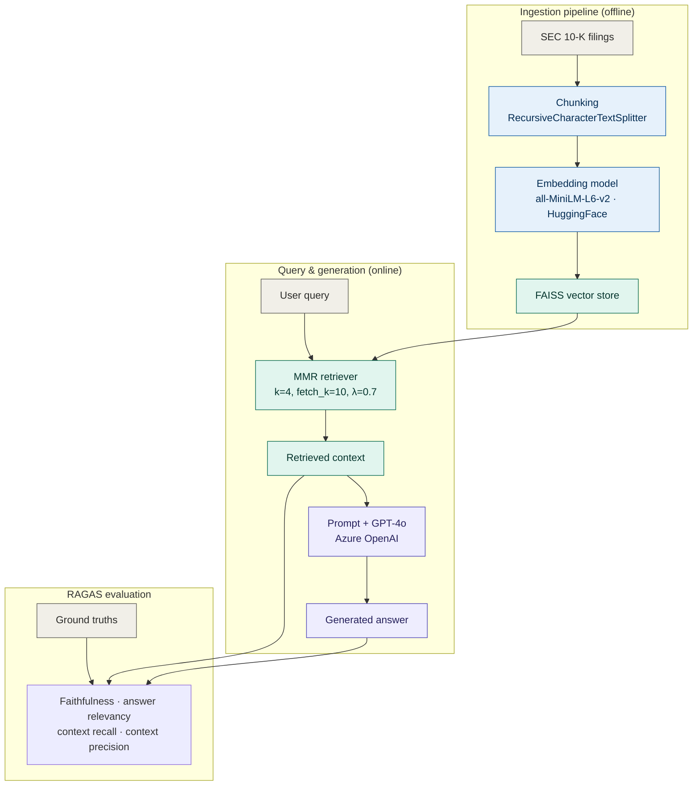

```mermaid
graph TD
    subgraph Ingestion["Ingestion pipeline (offline)"]
        A["SEC 10-K filings"] --> B["Chunking<br/>RecursiveCharacterTextSplitter"]
        B --> C["Embedding model<br/>all-MiniLM-L6-v2 · HuggingFace"]
        C --> D["FAISS vector store"]
    end

    subgraph Query["Query &amp; generation (online)"]
        Q["User query"] --> R["MMR retriever<br/>k=4, fetch_k=10, λ=0.7"]
        R --> CTX["Retrieved context"]
        CTX --> LLM["Prompt + GPT-4o<br/>Azure OpenAI"]
        LLM --> ANS["Generated answer"]
    end

    subgraph Eval["RAGAS evaluation"]
        GT["Ground truths"] --> METRICS["Faithfulness · answer relevancy<br/>context recall · context precision"]
    end

    D --> R
    CTX --> METRICS
    ANS --> METRICS

    classDef io fill:#F1EFE8,stroke:#5F5E5A,color:#2C2C2A;
    classDef ingest fill:#E6F1FB,stroke:#185FA5,color:#042C53;
    classDef store fill:#E1F5EE,stroke:#0F6E56,color:#04342C;
    classDef gen fill:#EEEDFE,stroke:#534AB7,color:#26215C;

    class A,Q,GT io;
    class B,C ingest;
    class D,R,CTX store;
    class LLM,ANS gen;
```
