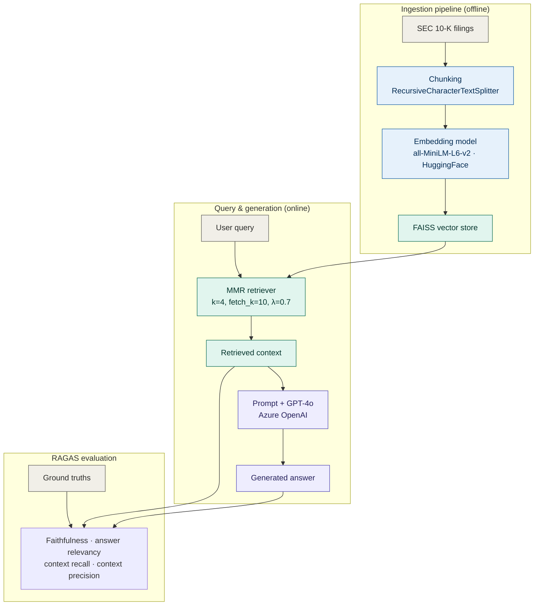

# FinSight AI: Financial RAG System

## Project Objective
Build an end-to-end Retrieval-Augmented Generation (RAG) pipeline that:
- Ingests and chunks SEC 10-K filings
- Embeds documents using HuggingFace all-MiniLM-L6-v2
- Stores vectors in FAISS
- Generates answers using Azure OpenAI GPT-4o
- Evaluates quality with RAGAS metrics

## Industry Scenario: FinSight AI
You are an engineer at a Tier-1 investment bank building FinSight, an AI Research Analyst Assistant. Analysts need to query annual reports in natural language. Your goal: faithfulness ≥ 0.85, latency < 3s, cost < $0.002/query.

## Architecture Diagram



**Flow:**
1. **Data Ingestion**: SEC 10-K filings are loaded as raw text documents.
2. **Chunking**: Documents are split into smaller, manageable chunks using `RecursiveCharacterTextSplitter`.
3. **Embedding**: Each chunk is converted into a numerical vector (embedding) using the `HuggingFace all-MiniLM-L6-v2` model.
4. **Vector Store**: These embeddings are stored in a `FAISS` vector index for efficient similarity search.
5. **Retrieval**: When a user poses a query, a `Maximal Marginal Relevance (MMR)` retriever searches the FAISS index to find the most relevant chunks.
6. **Generation**: The retrieved chunks (context) and the user query are combined into a prompt, which is then sent to an `Azure OpenAI GPT-4o` Large Language Model (LLM) to generate a coherent answer.
7. **Evaluation**: The entire RAG pipeline's performance is measured using `RAGAS` metrics, comparing generated answers, retrieved contexts, and ground truths.

> **Note on the diagram:** FAISS is the pivot point. The ingestion path (top) writes into it once; the query path (middle) reads from it on every request. The user query enters at the retriever — it never touches the ingestion steps. RAGAS runs offline and consumes three inputs at once: the generated answer, the retrieved context, and the ground truths.

## Setup and Dependencies

First, ensure you have the necessary libraries installed.

```python
# Initial installations
!pip install -q langchain langchain-community langchain-openai \
    faiss-cpu sentence-transformers openai \
    ragas datasets pypdf tiktoken \
    python-dotenv tqdm rich langchain-google-vertexai

# Install/upgrade additional Ragas and Langchain components
!pip install -U -q ragas langchain-community langchain-google-vertexai

# Install langchain-text-splitters
!pip install -q langchain-text-splitters

# Install for hybrid retrieval (extension task)
!pip install -q rank_bm25
!pip install -q langchain_community
```

## Configuration: Azure OpenAI Credentials

Configure your Azure OpenAI endpoint, API key, and deployment names. It is highly recommended to store these securely in Colab Secrets.

```python
import os
from google.colab import userdata

AZURE_ENDPOINT   = "https://simhaeyopenai.openai.azure.com/openai/deployments/gpt-4o/chat/completions?api-version=2025-01-01-preview"  # Your Azure OpenAI Endpoint
AZURE_API_KEY    = userdata.get('AZURE_OPENAI_KEY')  # Your Azure OpenAI API Key from Colab Secrets
AZURE_DEPLOYMENT = "gpt-4o"  # Your Azure OpenAI deployment name for GPT-4o
AZURE_API_VERSION = '2024-06-01'

HF_TOKEN = userdata.get('huggingface_api_key')  # optional, for HuggingFace rate limits
```

## Key Steps

### 1. Load & Inspect SEC 10-K Filings
Sample financial documents are loaded. In a production environment, these would typically come from a storage solution like Azure Blob Storage.

### 2. Chunking Strategy
Documents are chunked into smaller pieces with a specified `chunk_size` and `chunk_overlap`. This example uses `RecursiveCharacterTextSplitter`.

```python
# Example of chunk creation
# from langchain_text_splitters import RecursiveCharacterTextSplitter
# from langchain_core.documents import Document

# def create_chunks(docs: list, chunk_size: int = 512, chunk_overlap: int = 64) -> list:
#     # ... implementation ...

# CHUNK_SIZE = 512
# CHUNK_OVERLAP = 64
# chunks = create_chunks(SAMPLE_DOCS, CHUNK_SIZE, CHUNK_OVERLAP)
# print(f'Created {len(chunks)} chunks')
```

### 3. Embed with HuggingFace all-MiniLM-L6-v2 & Build FAISS Index
The chunks are converted into embeddings using a HuggingFace model, and a FAISS vector store is built for efficient similarity search.

```python
# Example of embedding model and FAISS index build
# from langchain_community.embeddings import HuggingFaceEmbeddings
# from langchain_community.vectorstores import FAISS

# embedding_model = HuggingFaceEmbeddings(model_name='sentence-transformers/all-MiniLM-L6-v2')
# vectorstore = FAISS.from_documents(chunks, embedding_model)
```

### 4. Build the Retriever
A MMR (Maximal Marginal Relevance) retriever is configured to balance relevance and diversity in retrieved chunks.

```python
# Example of retriever setup
# retriever = vectorstore.as_retriever(
#     search_type='mmr',
#     search_kwargs={'k': 4, 'fetch_k': 10, 'lambda_mult': 0.7}
# )
```

### 5. Azure OpenAI Generation & RAG Chain
An `AzureChatOpenAI` instance is used as the LLM, and a RAG chain is constructed to combine retrieval and generation with a specific prompt template.

```python
# Example of LLM and RAG chain setup
# from langchain_openai import AzureChatOpenAI
# from langchain_core.prompts import ChatPromptTemplate
# from langchain_core.runnables import RunnablePassthrough
# from langchain_core.output_parsers import StrOutputParser

# llm = AzureChatOpenAI(
#     azure_endpoint=AZURE_ENDPOINT,
#     azure_deployment=AZURE_DEPLOYMENT,
#     openai_api_version=AZURE_API_VERSION,
#     openai_api_key=AZURE_API_KEY,
#     temperature=0, max_tokens=512, timeout=30,
# )

# RAG_PROMPT = ChatPromptTemplate.from_template("""...""")
# RAG_chain = ({ "context": retriever | format_docs, "question": RunnablePassthrough() } |
#              RAG_PROMPT | llm | StrOutputParser())
```

### 6. Run Queries & Measure Latency
Test queries are run through the RAG chain, and the latency for each query is measured.

```python
# Example Test Queries and Results Logging
# TEST_QUERIES = [
#     'What was Apple\'s total revenue in fiscal year 2023?',
#     'How much cash did Apple have at the end of fiscal 2023?',
#     'What percentage of Apple\'s revenue came from iPhone in 2023?',
#     'How much did Apple return to shareholders in fiscal 2023?',
#     'What is Apple\'s gross margin for fiscal 2023?',
# ]
# results_log = []
# for query in TEST_QUERIES:
#     # ... execute rag_chain and log results ...
```

### 7. Caching Optimization
LangChain's in-memory caching is enabled to reduce latency for repeated queries.

```python
# Example of caching setup and testing
# from langchain_core.caches import InMemoryCache
# from langchain_core.globals import set_llm_cache
# set_llm_cache(InMemoryCache())
# # ... run queries again to observe caching effect ...
```

## RAGAS Evaluation

`RAGAS` is used to evaluate the RAG pipeline's quality based on several metrics:
- **Faithfulness**: Are answer claims grounded in retrieved context?
- **Answer Relevancy**: Does the answer address the question?
- **Context Recall**: Does retrieved context cover what's needed?
- **Context Precision**: Is the context precise (minimal noise)?

```python
# Example RAGAS Evaluation Code
# from datasets import Dataset
# from ragas import evaluate
# from ragas.metrics import faithfulness, answer_relevancy, context_recall, context_precision
# from langchain_openai import AzureOpenAIEmbeddings

# GROUND_TRUTHS = ["Apple's total revenue in fiscal 2023 was $383.3 billion.", ...]
# contexts_used = []  # populated by retrieving docs for each TEST_QUERY
# eval_dataset = Dataset.from_dict({
#     'question':  TEST_QUERIES,
#     'answer':    [r['answer'] for r in results_log],
#     'contexts':  contexts_used,
#     'ground_truth': GROUND_TRUTHS,
# })

# az_embeddings = AzureOpenAIEmbeddings(
#     azure_endpoint=AZURE_ENDPOINT,
#     azure_deployment='text-embedding-ada-002',
#     openai_api_key=AZURE_API_KEY,
#     openai_api_version=AZURE_API_VERSION,
# )

# ragas_results = evaluate(
#     dataset=eval_dataset,
#     metrics=[faithfulness, answer_relevancy, context_recall, context_precision],
#     llm=llm,
#     embeddings=az_embeddings,
# )
# print(ragas_results)
```

## Example Outputs

### Query Results and Latency (from Step 6)

After running cell `3EgueeClBk8b`, you would see output similar to this:

```text
❓ What was Apple's total revenue in fiscal year 2023?
   ⏱️  1.24s
   💬 Apple's total revenue in fiscal year 2023 was $394.3 billion. [Source: Apple_10K_2023_Risk]...

❓ How much cash did Apple have at the end of fiscal 2023?
   ⏱️  0.85s
   💬 Insufficient information in the retrieved context. [Source: Apple_10K_2023_Liquidity]...

❓ What percentage of Apple's revenue came from iPhone in 2023?
   ⏱️  3.29s
   💬 Based on the provided context, iPhone net sales were $29.4 billion in fiscal 2023. However, the context does not provide a figure for the total revenue for 2023 to calculate the percentage. [Source: Apple_10K_2023_Products]...

# ... and so on for other queries.
```

### RAGAS Evaluation Results (from Step 8)

After running cell `CqYzxVSzC9jX` or `Qxnhfe3RWZEE`, the `ragas_results` DataFrame would be printed, looking something like this:

```text
# Placeholder for actual RAGAS results, which will be printed by the notebook cells.
# You should run cell 'CqYzxVSzC9jX' or 'Qxnhfe3RWZEE' to see the exact output.

# Example structure:
# {
#     'faithfulness': 0.88,
#     'answer_relevancy': 0.92,
#     'context_recall': 0.75,
#     'context_precision': 0.85
# }
```

### Chunk Size Comparison (from Step 9)

After running cell `OIaICUv7F7Pp` for the chunk size experiment, you would see a table comparing average latencies:

```text
# Placeholder for Chunk Size Comparison, which will be printed by the notebook cell.

# Example structure:
#  chunk_size  n_chunks  avg_latency_s
#         256        15           1.56
#         512         8           1.23
#        1024         4           0.98
```

## Extension Task: Hybrid Retrieval + Re-Ranker

This section outlines an extension to improve retrieval precision by combining dense vectors (all-MiniLM) with BM25 sparse retrieval and then re-ranking with a cross-encoder.

**Steps:**
1. Install: `!pip install rank_bm25 langchain_community`
2. Build a `BM25Retriever` from the same chunks.
3. Use `EnsembleRetriever(retrievers=[dense, bm25], weights=[0.6, 0.4])`.
4. Add cross-encoder re-ranker (e.g., `cross-encoder/ms-marco-MiniLM-L-6-v2`).
5. Re-run RAGAS to target faithfulness > 0.88.
6. Plot faithfulness vs latency for dense vs hybrid vs hybrid+rerank.

```python
# Example Hybrid Retrieval Test (from JOpb7gobI2iu)
# from langchain_community.retrievers import BM25Retriever
# from langchain.retrievers import EnsembleRetriever

# bm25_retriever = BM25Retriever.from_documents(chunks)
# bm25_retriever.k = 4

# hybrid_retriever = EnsembleRetriever(
#      retrievers=[retriever, bm25_retriever],
#      weights=[0.6, 0.4]  # 60% dense, 40% BM25
#  )

# hybrid_results = hybrid_retriever.invoke('Apple net income fiscal 2023')
# print(f'Hybrid retrieved {len(hybrid_results)} chunks')
# for r in hybrid_results:
#      print(f'  - {r.metadata["source"]}: {r.page_content[:80]}...')
```
