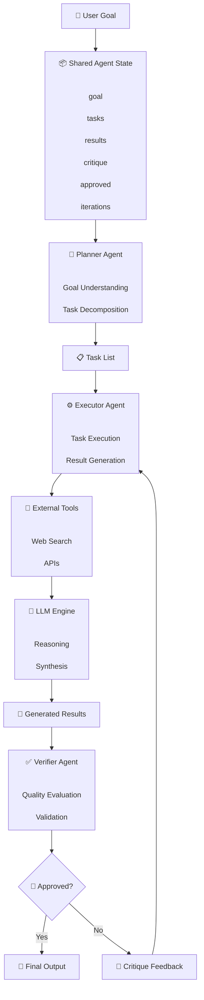
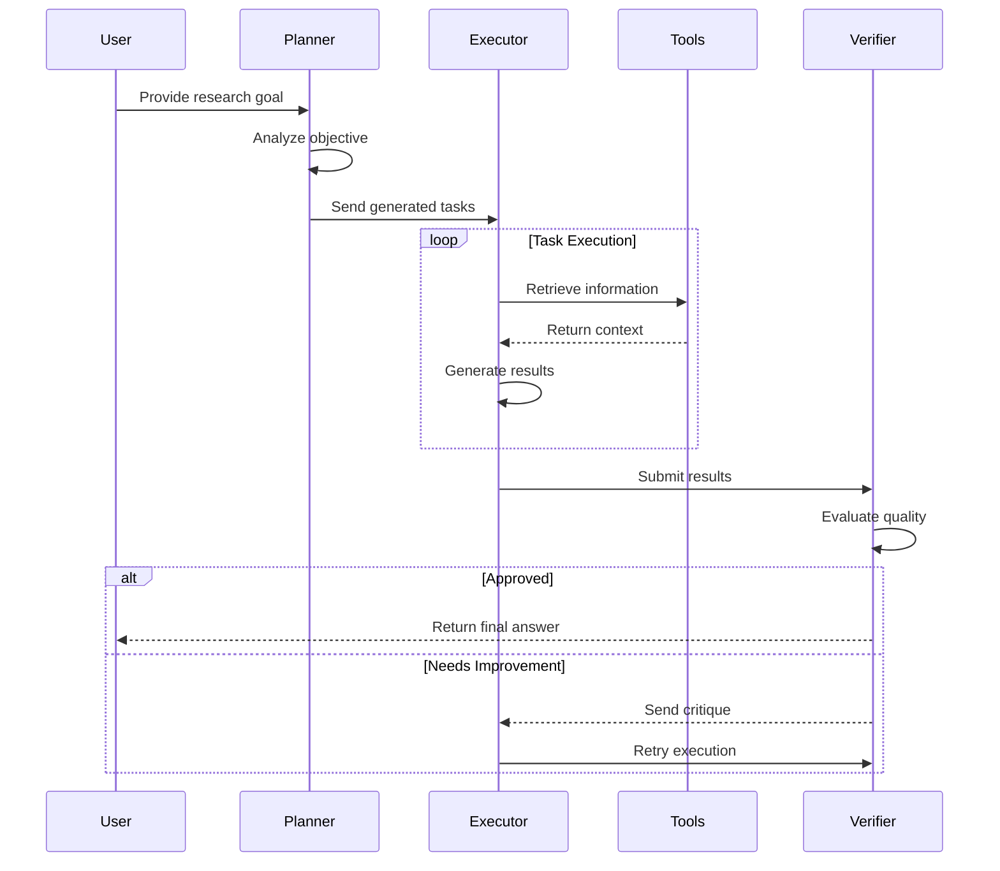
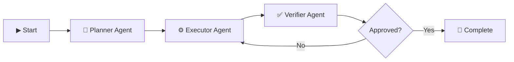

# 🚀 LangGraph Multi-Agent Research System

A scalable **multi-agent AI research architecture** built using **LangGraph** that autonomously transforms a user objective into executable tasks, performs research, validates generated results, and improves responses through an iterative feedback loop.

The architecture follows:

```
Plan → Execute → Verify → Refine
```

---

# 📌 Overview

This project demonstrates a multi-agent workflow where specialized AI agents collaborate through a shared state.

Instead of relying on a single LLM response, the system separates responsibilities into multiple agents:

| Agent | Responsibility |
|---|---|
| 🧠 Planner Agent | Understands the goal and creates actionable tasks |
| ⚙️ Executor Agent | Executes tasks, performs research, and generates outputs |
| ✅ Verifier Agent | Evaluates results and provides improvement feedback |

The entire workflow is managed using a LangGraph `StateGraph`.

---

# 🏗️ Architecture Diagram



---

# 🔄 Workflow Lifecycle



---

# 🧩 Agent Architecture

## 🧠 Planner Agent

### Purpose

The Planner Agent converts a high-level goal into smaller executable tasks.

### Responsibilities

- Understand user requirements
- Analyze the objective
- Identify required actions
- Generate structured tasks


Example:

### Input

```text
Research the top agriculture trends in 2025
```

### Output

```json
[
  "Analyze AI adoption in agriculture",
  "Research sustainable farming technologies",
  "Identify agriculture market trends"
]
```

---

# ⚙️ Executor Agent

### Purpose

The Executor Agent performs the generated tasks and produces results.

### Responsibilities

- Execute each task
- Use external tools
- Collect relevant information
- Apply LLM reasoning
- Generate structured outputs


Execution pipeline:

```
Task
 |
 v
Research Tools
 |
 v
LLM Processing
 |
 v
Generated Result
```

---

# ✅ Verifier Agent

### Purpose

The Verifier Agent acts as the quality assurance layer.

It validates the generated results against the original goal.

## Evaluation Criteria

| Metric | Description |
|---|---|
| Completeness | Checks whether the goal is fully addressed |
| Accuracy | Checks reliability of information |
| Clarity | Checks readability and structure |


Example:

```json
{
  "score": 9,
  "approved": true,
  "critique": ""
}
```

---

# 🔁 Feedback Loop

When results do not meet expectations:

```
Verifier
    |
    v
Critique Generated
    |
    v
Executor Improves Output
    |
    v
Verifier Re-checks
```

The workflow continues until:

- Results are approved
- Maximum iteration limit is reached

---

# 📦 AgentState

The shared state object used by LangGraph.

```python
class AgentState(TypedDict):

    goal: str
    """
    User objective
    """


    tasks: List[str]
    """
    Tasks created by Planner
    """


    results: List[str]
    """
    Results generated by Executor
    """


    critique: str
    """
    Feedback from Verifier
    """


    approved: bool
    """
    Validation status
    """


    iterations: int
    """
    Number of execution cycles
    """
```

---

# 🔀 LangGraph Routing



---

# ▶️ Usage Example

```python
initial_state: AgentState = {

    "goal":
    "Research and summarise the top 3 agriculture trends in 2025",

    "tasks": [],

    "results": [],

    "critique": "",

    "approved": False,

    "iterations": 0
}


final_state = app.invoke(initial_state)
```

---

# 📄 Example Final State

```python
{
    "goal": "Research agriculture trends",

    "tasks": [
        "Analyze AI farming adoption",
        "Study sustainable agriculture"
    ],

    "results": [
        "AI-powered farming is expanding..."
    ],

    "critique": "",

    "approved": True,

    "iterations": 1
}
```

---

# ✨ Features

- ✅ Multi-agent AI orchestration
- ✅ Stateful workflow execution
- ✅ Autonomous task planning
- ✅ Research automation
- ✅ Self-correction mechanism
- ✅ Quality validation
- ✅ Modular architecture


---

# 🚀 Future Enhancements

- Parallel agent execution
- Persistent memory
- Human approval workflow
- Domain-specific expert agents
- Enterprise data integration
- Advanced evaluation models


---

# 🛠️ Technology Stack

| Technology | Usage |
|---|---|
| Python | Core implementation |
| LangGraph | Agent workflow management |
| LangChain | AI agent framework |
| LLMs | Reasoning and generation |
| Search APIs | External knowledge retrieval |


---

# 📌 Summary

This LangGraph architecture provides a foundation for building autonomous AI systems.

The workflow separates intelligence into specialized components:

```
User Goal
    |
    v
Planner Agent
    |
    v
Executor Agent
    |
    v
Verifier Agent
    |
    v
Final Validated Output
```

By combining planning, execution, and verification, the system enables reliable and scalable AI agent workflows.
