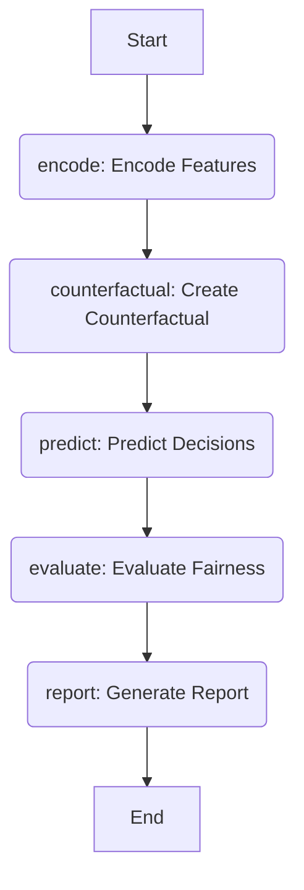

# Counterfactual Fairness Production Pipeline

This notebook implements a **Counterfactual Fairness Production Pipeline** using `langgraph` to evaluate the fairness of a machine learning model's decisions with respect to a protected attribute (e.g., gender).

## Table of Contents
1.  [Introduction](#introduction)
2.  [Pipeline Overview](#pipeline-overview)
3.  [Architecture Diagram](#architecture-diagram)
4.  [Components](#components)
5.  [How it Works](#how-it-works)
6.  [Interpretation of Results](#interpretation-of-results)
7.  [Example Output](#example-output)
8.  [Setup and Execution](#setup-and-execution)
9.  [Extension and Further Steps](#extension-and-further-steps)

## 1. Introduction
Counterfactual fairness assesses whether a model's decision changes for an individual if a protected attribute were to change while all other non-protected attributes remained the same. In simpler terms, if a loan applicant was denied, would they have been approved if their gender (or other protected attribute) were different, assuming everything else was equal?

This notebook demonstrates a pipeline to:
*   Generate synthetic loan application data with built-in demographic biases.
*   Train a Random Forest Classifier to make lending decisions.
*   Evaluate the classifier's counterfactual fairness using a `langgraph` state machine.

## 2. Pipeline Overview
The core of the fairness evaluation is built using `langgraph`, a library for building stateful, multi-actor applications. The pipeline consists of the following sequential steps:
1.  **Encode Features**: Prepare the original dataset by encoding categorical features.
2.  **Create Counterfactual**: Generate a counterfactual version of the dataset by flipping the protected attribute (gender).
3.  **Predict Decisions**: Use the trained classifier to make predictions on both the original and counterfactual datasets.
4.  **Evaluate Fairness**: Compare the original and counterfactual predictions to identify instances where the decision changed.
5.  **Generate Report**: Summarize the findings and provide a verdict on the model's counterfactual fairness.

## 3. Architecture Diagram



## 4. Components

### Synthetic Data Generation (`generate_loan_dataset`)
This function creates a synthetic dataset of loan applications, including attributes like gender, age, region, income, credit score, loan amount, employment type, and existing loans. Crucially, it injects historical demographic biases to simulate real-world scenarios where certain groups (e.g., females, residents of Tier3 regions, older applicants) might face higher rejection rates.

### LangGraph State (`FairnessState`)
This `TypedDict` defines the state that is passed between the nodes of the `langgraph` pipeline. It includes:
*   `df_orig`: The original (or encoded) DataFrame.
*   `clf`: The trained classifier model.
*   `scaler`: The fitted StandardScaler for feature scaling.
*   `feature_cols_all`: List of all features used by the model.
*   `X_orig`: Encoded features for original predictions.
*   `X_cf`: Encoded features for counterfactual predictions.
*   `pred_orig`: Predictions for the original data.
*   `pred_cf`: Predictions for the counterfactual data.
*   `pct_changed`: The percentage of decisions that changed.
*   `report`: The final fairness report.

### LangGraph Nodes
*   **`encode_features`**: Takes the raw DataFrame, applies `LabelEncoder` to categorical features (`gender`, `region`, `employment_type`), and prepares `X_orig`.
*   **`create_counterfactual`**: Generates `X_cf` by taking `X_orig` and flipping the `gender_enc` attribute (0 becomes 1, 1 becomes 0).
*   **`predict_decisions`**: Uses the `clf` (Random Forest Classifier) and `scaler` to make predictions (`pred_orig` and `pred_cf`) on both the original and counterfactual feature sets.
*   **`evaluate_fairness`**: Compares `pred_orig` and `pred_cf` to calculate `pct_changed`, which is the proportion of applicants whose decision flipped due to the gender change.
*   **`generate_report`**: Creates a human-readable summary, including the total applicants, the number and percentage of changed decisions, a verdict based on a 5% threshold, and a sample of applicants whose decisions were flipped.

### LangGraph Pipeline Construction
The `StateGraph` connects these nodes sequentially, defining the flow of data and execution: `encode` -> `counterfactual` -> `predict` -> `evaluate` -> `report` -> `END`.

### Classifier Training
Before running the `langgraph` pipeline, a `RandomForestClassifier` is trained on the synthetic data. This involves:
1.  Encoding categorical features for training.
2.  Scaling numerical features using `StandardScaler`.
3.  Fitting the `RandomForestClassifier` to predict `rejected` status.

## 5. How it Works
1.  **Data Preparation**: Synthetic loan data is generated, complete with encoded features.
2.  **Model Training**: A Random Forest Classifier learns to predict loan rejection based on this data, implicitly learning the biases present in the synthetic data.
3.  **Fairness Evaluation**: The `langgraph` pipeline is executed:
    *   It takes the original applications and creates a second set where only the gender of each applicant is swapped.
    *   The model predicts decisions for both the original and gender-flipped applications.
    *   The decisions are compared. If the model's decision changes solely because of the gender flip (e.g., approved -> denied, or denied -> approved), it indicates a potential fairness issue.
4.  **Reporting**: A detailed report is generated, highlighting the percentage of applications where the decision flipped and providing a verdict based on a predefined threshold (here, 5%).

## 6. Interpretation of Results
The key metric is `Percentage changed`. 

*   If `Percentage changed` is **low (e.g., < 5%)**, it suggests that changing the protected attribute (gender) does not significantly alter the model's decision, indicating **approximate counterfactual fairness**.
*   If `Percentage changed` is **high (e.g., > 5%)**, it implies that the model's decision is sensitive to the protected attribute, indicating a **lack of counterfactual fairness** and potential gender-based discrimination.

The `Sample Flipped Decisions Table` in the report provides concrete examples of applicants whose outcomes would change if their gender were different, allowing for deeper investigation into the model's behavior.

## 7. Example Output

```
🚀 Generating Synthetic Loan Dataset...
🛠️ Encoding and Preprocessing for Model Training...
🤖 Training Random Forest Classifier...
🔗 Executing LangGraph Counterfactual Fairness Evaluation...

⚖️ COUNTERFACTUAL FAIRNESS TEST — Gender

Total applicants: 3000
Decision changed on flip: 881
Percentage changed: 29.37%

Verdict:
❌ NOT counterfactually fair — gender influences decisions

Sample Flipped Decisions Table:
    gender region  credit_score   income  orig_pred  cf_pred
4     Male  Tier1         712.0  49452.0          0        1
6   Female  Tier2         652.0  32440.0          1        0
8     Male  Tier3         773.0  71608.0          1        0
9     Male  Tier1         767.0  81381.0          1        0
11  Female  Tier2         784.0  68460.0          1        0
12  Female  Tier3         651.0  45943.0          1        0
14    Male  Tier1         666.0  77935.0          0        1
17    Male  Tier1         660.0  47698.0          0        1
18  Female  Tier3         747.0  94458.0          0        1
21    Male  Tier2         623.0  88934.0          0        1

Final metric: percentage changed = 0.2937
```

## 8. Setup and Execution

To run this notebook:
1.  Ensure you have the necessary libraries installed (`numpy`, `pandas`, `scikit-learn`, `langgraph`).
2.  Execute all cells sequentially.
3.  The final output will be a fairness report printed to the console, followed by the `Final metric: percentage changed`.

## 9. Extension and Further Steps
*   **Other Protected Attributes**: The pipeline can be extended to evaluate fairness for other protected attributes (e.g., `region`, `age`) by modifying the `create_counterfactual` node.
*   **Fairness Definitions**: Explore other fairness metrics and definitions (e.g., demographic parity, equal opportunity).
*   **Bias Mitigation**: Implement bias mitigation techniques (e.g., pre-processing, in-processing, post-processing) and evaluate their impact on counterfactual fairness.
*   **Real-world Data**: Adapt the pipeline to work with real-world datasets, ensuring proper data loading and preprocessing.
*   **More Complex Models**: Integrate more complex machine learning models or deep learning architectures.
