# Agentic Budget Allocation Planner

A Streamlit app that combines Short-Term Memory (STM) and Long-Term Memory (LTM) to produce a realistic annual budget allocation across multiple domains. The app supports three execution modes:

- Groq backend (original): calls Groq chat completions for Planner/Executor/Validator.
- Hugging Face Inference API: alternative LLM backend via HF Inference API.
- Demo/local heuristics: runs without any API key for offline/testing/demo use.

**Main file:** `Agentic-ai.py`

---

## Quick start

1. Activate your virtualenv (this project uses `env/`):

```powershell
& env\Scripts\Activate.ps1
```

2. Install dependencies:

```bash
pip install -r requirements.txt
```

3. Run the Streamlit app:

```bash
streamlit run Agentic-ai.py
```

4. Open the app at: http://localhost:8501

- Choose Backend in the sidebar: `HuggingFace (Inference API)` or `Groq`.
- Paste the corresponding API key (HF: `hf_...`, Groq: `gsk_...`) or click `Start demo (prefill values)` to run offline.

---

## Architecture (Mermaid)

```mermaid
flowchart LR
  subgraph UI
    A[Sidebar: backend, keys, budget] --> B[Main Controls: Run / Start demo]
    B --> C[Agent Cards: Planner / Executor / Validator]
  end

  subgraph Backend
    D[Planner Agent]
    E[Executor Agent]
    F[Validator Agent]
  end

  subgraph LLMs
    G[Groq API]
    H[Hugging Face Inference API]
  end

  C --> D
  D -->|calls| G
  D -->|calls| H
  D --> E
  E -->|calls| G
  E -->|calls| H
  E --> F
  F -->|calls| G
  F -->|calls| H
  F --> C

  style UI fill:#0b1220,stroke:#0b1220;color:#cbd5e0
  style Backend fill:#111827,stroke:#111827,color:#cbd5e0
  style LLMs fill:#0f1724,stroke:#0f1724,color:#fbbf24
```



---

## Components & Flow (End-to-end)

1. User fills domain inputs (STM and LTM fields) for each domain in the UI and chooses Backend.
2. When `Generate Budget Plan` is clicked:
   - The app builds a textual `context` combining fiscal info, STM requests and LTM baselines.
   - The Planner Agent is invoked with that context. If a remote LLM backend is selected, the app calls the chosen API (Groq or HF). If no key or on error, a local heuristic fallback generates allocations.
   - The Planner returns a JSON plan with `strategy`, `allocations`, and `assumptions`.
3. The Executor Agent receives the approved `plan` and drafts an implementation plan (phasing, priorities).
4. The Validator Agent reviews the allocation + execution and returns a `score`, `strengths`, `risks`, and a summary.
5. Results are displayed: metrics, charts, allocation cards, downloadable JSON.

---

## How the backends are used

- Groq: `get_client()` returns a Groq client and `call_groq()` routes planner/executor/validator requests to Groq chat completions.
- Hugging Face: `get_client()` returns a descriptor `{'backend':'hf','key': hf_key}` and `call_groq()` routes calls to `call_hf()` which uses the HF Inference API `POST /models/{model}` endpoint.
- Demo fallback: When no key is provided or API calls fail, the app runs lightweight heuristics locally so the UI still demonstrates allocation and charts.

---

## Files

- `Agentic-ai.py` — main Streamlit app
- `requirements.txt` — Python dependencies
- `README.md` — this file

---

## Notes & Next steps

- If you want on-device inference (no cloud keys), I can add a `transformers` local runner, but it requires installing `torch` and a compatible model (heavier).
- I can also add automated key validation and explicit clearing of invalid keys on 401 responses.

If you'd like, I can add a small test script that exercises the selected HF model and shows the raw response for debugging.
