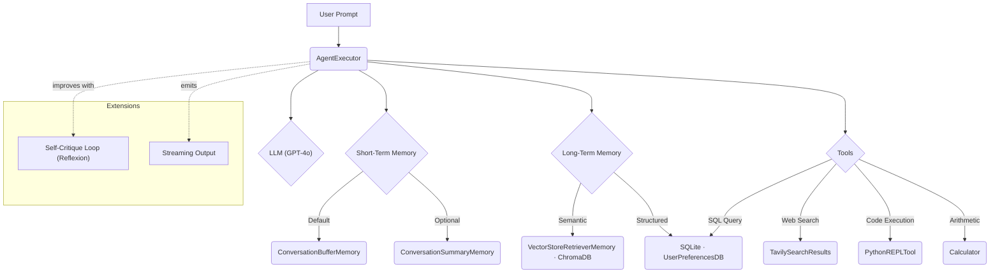

# 🧠 LangChain Memory Agent — Short-Term & Long-Term Memory + Tools

> A production-style **ReAct agent** built with LangChain that combines short-term conversational memory, persistent long-term memory (vector + structured), and a toolbelt for web search, code execution, and arithmetic.

<p align="left">
  
  
  
  
  
</p>

This project demonstrates how to assemble a sophisticated LangChain agent that reasons and acts (ReAct) while remembering. It maintains **short-term memory** for the current session, **long-term memory** that survives across sessions, and a set of **tools** that let it reach beyond the model's own knowledge.

---

## 📑 Table of Contents

- [Features](#-features)
- [Architecture](#-architecture)
- [Prerequisites](#-prerequisites)
- [Installation](#-installation)
- [Configuration](#-configuration)
- [Quickstart](#-quickstart)
- [Components](#-components)
  - [1. LLM Initialization](#1-llm-initialization)
  - [2. Short-Term Memory (STM)](#2-short-term-memory-stm)
  - [3. Long-Term Memory (LTM)](#3-long-term-memory-ltm)
  - [4. Tools](#4-tools)
  - [5. Agent Assembly](#5-agent-assembly)
- [Usage Examples](#-usage-examples)
- [Extensions](#-extensions)
- [Project Structure](#-project-structure)
- [Key Takeaways](#-key-takeaways)
- [Troubleshooting](#-troubleshooting)
- [Contributing](#-contributing)
- [License](#-license)
- [Acknowledgements](#-acknowledgements)

---

## ✨ Features

| Capability | Description |
| --- | --- |
| 🔄 **ReAct reasoning loop** | The agent interleaves *reasoning* (thoughts) and *acting* (tool calls) to solve multi-step tasks. |
| 💬 **Short-Term Memory** | A rolling conversation window keeps the current session coherent (`ConversationBufferMemory`), with an optional summarizing variant for long chats. |
| 🗄️ **Long-Term Memory** | Persistent recall via a ChromaDB vector store (semantic) and a SQLite database (structured user preferences). |
| 🌐 **Web Search** | Real-time information and current events through Tavily. |
| 🐍 **Code Execution** | Runs arbitrary Python for data analysis and computation via a Python REPL tool. |
| 🧮 **Safe Arithmetic** | A custom calculator for quick, sandboxed math. |
| 🔁 **Reflexion (optional)** | A self-critique loop that lets the agent revise its own answers. |
| 📡 **Streaming (optional)** | Token-level streaming of the agent's thought process for responsive UX. |

---

## 🏗️ Architecture

The core follows a **ReAct (Reasoning + Acting)** pattern:

```
User Prompt → AgentExecutor (ReAct LLM + STM + Tools) → LTM (ChromaDB)
```

- **STM (Short-Term Memory):** a rolling conversation window tracking the current session's dialogue.
- **LTM (Long-Term Memory):** a semantic vector store (ChromaDB) that persists across sessions, letting the agent recall past interactions and user preferences.
- **Tools:** external functions the agent calls to fetch real-time information, run code, or compute.



---

## ✅ Prerequisites

- **Python 3.10+**
- An **OpenAI API key** (required, for the `gpt-4o` reasoning model)
- A **Tavily API key** (optional, only needed for the web search tool)
- A virtual environment is strongly recommended (`venv`, `conda`, or `uv`)

---

## ⚙️ Installation

Clone the repository and install dependencies:

```bash
# 1. Clone
git clone https://github.com/<your-username>/langchain-memory-agent.git
cd langchain-memory-agent

# 2. Create and activate a virtual environment
python -m venv .venv
source .venv/bin/activate          # On Windows: .venv\Scripts\activate

# 3. Install dependencies
pip install -r requirements.txt
```

Suggested `requirements.txt`:

```txt
langchain
langchain-openai
langchain-community
openai
chromadb
tavily-python
python-dotenv
```

---

## 🔐 Configuration

The notebook/agent loads credentials from a `.env` file in the project root. Create one based on the example below:

```dotenv
# .env
OPENAI_API_KEY="your_openai_key"
TAVILY_API_KEY="your_tavily_key"   # Optional — only for web search
```

> ⚠️ **Never commit your `.env` file.** Add it to `.gitignore` so your keys stay private.

```gitignore
.env
chroma_ltm/
*.sqlite3
__pycache__/
```

---

## 🚀 Quickstart

A minimal end-to-end example of building and running the agent:

```python
from dotenv import load_dotenv
from langchain_openai import ChatOpenAI

load_dotenv()  # reads OPENAI_API_KEY (and TAVILY_API_KEY) from .env

# 1. The reasoning model
llm = ChatOpenAI(model="gpt-4o", temperature=0, max_tokens=2048)

# 2. Build STM, LTM, and tools (see the Components section)
# 3. Wire everything into an AgentExecutor
# 4. Run a query
response = agent_executor.invoke({"input": "What AI framework should I use for my project?"})
print(response["output"])
```

---

## 🧩 Components

### 1. LLM Initialization

The agent uses OpenAI's `gpt-4o` model for reasoning. A temperature of `0` keeps tool-using behavior deterministic.

```python
from langchain_openai import ChatOpenAI

llm = ChatOpenAI(
    model="gpt-4o",
    temperature=0,
    max_tokens=2048,
)
```

### 2. Short-Term Memory (STM)

STM keeps the current session coherent. Two strategies are explored:

- **`ConversationBufferMemory`** — stores the entire conversation verbatim. Simple and lossless, but token usage grows with the chat.
- **`ConversationSummaryMemory`** — summarizes older exchanges to conserve tokens, making it suitable for longer sessions.

```python
from langchain.memory import ConversationBufferMemory

stm = ConversationBufferMemory(
    memory_key="chat_history",
    return_messages=True,
)
```

> **Rule of thumb:** use the buffer for short sessions where fidelity matters; switch to summary memory when the conversation outgrows your token budget.

### 3. Long-Term Memory (LTM)

LTM provides recall that persists **across sessions**. Two complementary approaches:

- **Semantic LTM — `VectorStoreRetrieverMemory` + ChromaDB:** stores Q&A pairs in a vector database (the `chroma_ltm/` directory) so the agent can retrieve semantically similar past context.
- **Structured LTM — SQLite + `StructuredTool`:** stores explicit, queryable facts such as user preferences or project details, accessible through SQL.

```python
from langchain.memory import VectorStoreRetrieverMemory
from langchain_community.vectorstores import Chroma
from langchain_openai import OpenAIEmbeddings

vectorstore = Chroma(
    collection_name="ltm",
    embedding_function=OpenAIEmbeddings(),
    persist_directory="chroma_ltm",
)
retriever = vectorstore.as_retriever(search_kwargs={"k": 3})
ltm = VectorStoreRetrieverMemory(retriever=retriever)
```

### 4. Tools

The agent's capabilities are extended through tools:

| Tool | Type | Purpose |
| --- | --- | --- |
| `TavilySearchResults` | Web search | Real-time information and current events |
| `PythonREPLTool` | Code execution | Run arbitrary Python for computation/analysis |
| `Calculator` | Custom | Safe arithmetic evaluation for simple expressions |
| `UserPreferencesDB` | SQL (extension) | Query the SQLite structured LTM |

```python
from langchain_community.tools.tavily_search import TavilySearchResults
from langchain_experimental.tools.python.tool import PythonREPLTool

tools = [
    TavilySearchResults(max_results=3),
    PythonREPLTool(),
    # Calculator(), UserPreferencesDB() — see extensions
]
```

> 🔒 **Security note:** the Python REPL executes arbitrary code. Run it only in a sandboxed or trusted environment, never directly against untrusted user input in production.

### 5. Agent Assembly

The `AgentExecutor` orchestrates the LLM, STM, LTM, and tools using a ReAct agent loop. A custom prompt template guides the agent's reasoning.

```python
from langchain.agents import create_react_agent, AgentExecutor
from langchain import hub

prompt = hub.pull("hwchase17/react-chat")  # or a custom ReAct template

agent = create_react_agent(llm=llm, tools=tools, prompt=prompt)

agent_executor = AgentExecutor(
    agent=agent,
    tools=tools,
    memory=stm,
    verbose=True,
    handle_parsing_errors=True,
)
```

---

## 💡 Usage Examples

### Test 1 — Personalized response using LTM

**Question:** *"What AI framework should I use for my project?"*

The agent retrieves the user's stored context (building a RAG pipeline over internal financial documents, prefers LangChain).

> **Thought:** The user's LTM indicates they are building a RAG pipeline over internal financial documents and prefer LangChain. I should recommend LangChain.
>
> **Answer:** "Based on your past preferences and project (a RAG pipeline over internal financial documents), you should consider LangChain — it's well suited for systems like yours."

### Test 2 — Multi-step with web search + calculation

**Question:** *"What is the current population of India? Calculate what 0.5% of that would be, and convert to millions."*

The agent uses **Tavily Search** for the figure and the **Calculator** for the math.

> **Answer (example):** "India's population is approximately 1,428,627,663. 0.5% of that is 7,143,138.315 — roughly **7.14 million**."

### Test 3 — Short-term memory follow-up

1. **User:** "Tell me about the latest developments in transformer architectures."
2. **Agent:** *(summarizes recent advancements)*
3. **User:** "Which of those would be most relevant to my work?"

The agent uses **STM** to resolve "those" and **LTM** to connect it to the user's work.

> **Answer (example):** "Given your RAG pipeline for financial documents, advances in retrieval-augmented generation, efficient long-context attention, and finance-specialized models are likely most relevant."

### Test 4 — Python REPL for data analysis

**Question:** *"Generate the first 10 Fibonacci numbers, compute their sum, and tell me each number's percentage contribution to the total."*

The agent writes and runs Python via the `PythonREPLTool`.

> **Answer (example):**
> First 10 Fibonacci numbers: `[0, 1, 1, 2, 3, 5, 8, 13, 21, 34]`
> Sum: `88`
> Contributions: 34 → 38.64%, 21 → 23.86%, 13 → 14.77%, 8 → 9.09%, … and so on.

---

## 🔬 Extensions

- **`ConversationSummaryMemory`** — a summarizing STM strategy to manage context length on long sessions.
- **SQLite tool (structured LTM)** — query a SQL database for specific, explicit user preferences.
- **Self-critique loop (Reflexion pattern)** — the agent critiques and revises its own answers, improving quality at the cost of extra latency and tokens.
- **Streaming agent output** — a custom callback handler streams the agent's thoughts and tokens in real time.

---

## 📂 Project Structure

```
langchain-memory-agent/
├── README.md
├── requirements.txt
├── .env                  # your API keys (gitignored)
├── .gitignore
├── notebook.ipynb        # the Day 16 Colab walkthrough
├── chroma_ltm/           # persisted ChromaDB vector store (gitignored)
└── preferences.sqlite3   # structured LTM (gitignored)
```

---

## 🎯 Key Takeaways

- **STM ≠ LTM.** They serve distinct purposes and are most powerful when combined.
- **Buffer vs. Summary.** Pick the STM strategy based on session length and token budget.
- **LTM retrieval matters.** It needs an effective strategy — semantic (vector search) or structured (database queries).
- **Reflexion helps quality.** A self-critique loop can meaningfully improve answers, at the cost of latency and tokens.
- **Streaming improves UX.** Live feedback on the agent's thought process is essential in production.

---
- [OpenAI](https://openai.com/) for the `gpt-4o` model
- [Chroma](https://www.trychroma.com/) for the vector store
- [Tavily](https://tavily.com/) for the search API
