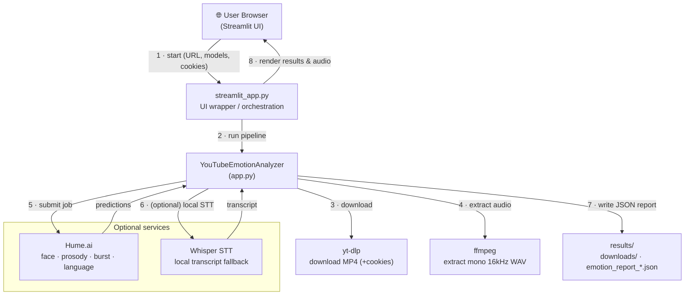

# 🎭 YouTube Emotion Analyzer

> Download a YouTube video, extract its audio, and run multi-modal **emotion analysis** (face, voice/prosody, vocal bursts, and language) — powered by [Hume.ai](https://hume.ai), with a local **Whisper** transcription fallback and a built-in **simulation mode** so the app stays fully usable even without API keys.

<p align="center">
  
</p>

<p align="center">
  
  
  
  
  
</p>

---

## 📑 Table of Contents

1. [Overview](#-overview)
2. [Features](#-features)
3. [Architecture](#-architecture)
4. [Project Structure](#-project-structure)
5. [Prerequisites](#-prerequisites)
6. [Installation](#-installation)
7. [Configuration](#-configuration)
8. [Usage](#-usage)
9. [End-to-End Pipeline (Start → Finish)](#-end-to-end-pipeline-start--finish)
10. [Output Details](#-output-details)
11. [Modes of Operation](#-modes-of-operation)
12. [Troubleshooting](#-troubleshooting)
13. [Security & Privacy](#-security--privacy)
14. [Roadmap](#-roadmap)
15. [Contributing](#-contributing)
16. [License](#-license)

---

## 🔎 Overview

**YouTube Emotion Analyzer** takes a YouTube URL and turns it into a structured emotion report. The pipeline downloads the video, extracts a clean audio track, and submits the media to Hume.ai's expression-measurement models. Where Hume's language output is unavailable, it falls back to a **local Whisper** transcription so you always get text. If the Hume SDK or API key is missing entirely, it produces **simulated results** so you can demo and develop the full UI offline.

The repository ships two entry points:

| File | Role |
|------|------|
| `app.py` | Core analysis library — download, audio extraction, Hume orchestration, simulation, Whisper fallback, and JSON report assembly. |
| `streamlit_app.py` | Streamlit UI wrapper that drives the pipeline from your browser and renders results, audio playback, and downloadable JSON. |
| `results/` | Default output directory for downloaded media, extracted audio, and JSON reports. |

---

## ✨ Features

- **Multi-model emotion analysis** — run any combination of `face`, `prosody`, `burst`, and `language` models.
- **Streamlit UI** — paste a URL, pick models, run, and view results in your browser.
- **Cookie-based access** — upload a `cookies.txt` to fetch age- or region-restricted videos via `yt-dlp --cookies`.
- **Audio extraction & playback** — extract a mono 16 kHz WAV with `ffmpeg` and play it in the UI.
- **Local Whisper STT fallback** — transcribe locally when Hume's language output is missing.
- **Simulation mode** — full UI remains functional without a Hume SDK/key for testing and demos.
- **Portable JSON reports** — every run is saved as a timestamped, self-describing JSON file.

---

## 🏗 Architecture

The diagram at the top of this README (`architecture.svg`) shows the full data flow. The same flow is provided below as **Mermaid** source, which GitHub renders automatically and which you can edit directly.



### Component responsibilities

| Component | Responsibility |
|-----------|----------------|
| **Streamlit UI** | Collects the URL, selected models, optional cookies, and toggles; triggers the run; renders results, audio, and the JSON download. |
| **`YouTubeEmotionAnalyzer`** | The orchestrator. Calls `yt-dlp`, `ffmpeg`, Hume, and Whisper; merges transcripts into the `language` section; assembles and persists the final report. |
| **yt-dlp** | Downloads the source MP4, optionally authenticating with an uploaded `cookies.txt`. |
| **ffmpeg** | Extracts a mono 16 kHz WAV suitable for Whisper and prosody analysis. |
| **Hume.ai** *(optional)* | Cloud expression-measurement models for face, prosody, vocal burst, and language emotions. |
| **Whisper** *(optional)* | Local speech-to-text fallback that fills the `language` transcript when Hume is unavailable. |
| **`results/`** | Persisted downloads, extracted audio, and timestamped JSON reports. |

---

## 📂 Project Structure

```
youtube-emotion-analyzer/
├── app.py                   # Core analysis library
├── streamlit_app.py         # Streamlit UI wrapper
├── architecture.svg         # Rendered architecture diagram (embedded above)
├── requirements.txt         # Python dependencies
├── .env.example             # Sample environment file (copy to .env)
├── README.md
└── results/                 # Created at runtime
    ├── downloads/           # Downloaded MP4 + extracted WAV files
    └── emotion_report_<video>_<timestamp>.json
```

---

## ✅ Prerequisites

| Requirement | Required? | Notes |
|-------------|-----------|-------|
| **Python 3.9+** | Yes | Tested with 3.9–3.12. |
| **yt-dlp** | Yes | Installed via `pip`; handles downloads. |
| **ffmpeg** | Recommended | Needed for audio extraction & playback. [Download here](https://ffmpeg.org/download.html). |
| **openai-whisper** | Optional | Enables local STT fallback. |
| **Hume.ai API key** | Optional | Without it, the app runs in **simulation mode**. |

> 💡 ffmpeg must be on your system `PATH`. On Windows, add the `bin/` folder to PATH; on macOS use `brew install ffmpeg`; on Debian/Ubuntu use `sudo apt install ffmpeg`.

---

## ⚙️ Installation

### Windows (PowerShell)

```powershell
# 1. Clone
git clone https://github.com/<your-username>/youtube-emotion-analyzer.git
cd youtube-emotion-analyzer

# 2. Create & activate a virtual environment
python -m venv env
& env\Scripts\Activate.ps1

# 3. Install core dependencies
env\Scripts\python -m pip install -U pip
env\Scripts\python -m pip install -r requirements.txt

# 4. (Optional) Install Whisper for local STT
env\Scripts\python -m pip install -U openai-whisper

# 5. Install ffmpeg separately: https://ffmpeg.org/download.html
```

### macOS / Linux (bash)

```bash
git clone https://github.com/<your-username>/youtube-emotion-analyzer.git
cd youtube-emotion-analyzer

python3 -m venv env
source env/bin/activate

pip install -U pip
pip install -r requirements.txt
pip install -U openai-whisper      # optional

# macOS:  brew install ffmpeg
# Ubuntu: sudo apt install ffmpeg
```

If you don't have a `requirements.txt` yet, a minimal one looks like:

```txt
streamlit
yt-dlp
hume            # optional, enables real Hume analysis
python-dotenv
openai-whisper  # optional
```

---

## 🔧 Configuration

Create a `.env` file in the project root (copy from `.env.example`) and add your Hume key:

```dotenv
HUME_API_KEY=your_hume_api_key_here
```

The app reads `HUME_API_KEY` from the environment. **Do not commit `.env`** — add it to `.gitignore`. If the key (or the `hume` SDK) is missing, the analyzer automatically switches to simulation mode.

---

## ▶️ Usage

### Run the Streamlit UI

```powershell
# Windows
env\Scripts\python -m streamlit run streamlit_app.py
```

```bash
# macOS / Linux
python -m streamlit run streamlit_app.py
```

Then open **http://localhost:8501**.

### UI controls

| Control | What it does |
|---------|--------------|
| **YouTube URL** | The video to analyze. |
| **Models** | Choose any of `face`, `prosody`, `burst`, `language`. |
| **Upload `cookies.txt`** | Authenticates `yt-dlp` for restricted videos. |
| **Extract and play audio** | Runs `ffmpeg` to create a WAV and plays it in-browser. |
| **Use local Whisper STT fallback** | Transcribes audio locally when Hume language output is missing. |
| **Download JSON** | Saves the full results dictionary. |

### Programmatic use (library)

```python
from app import YouTubeEmotionAnalyzer

analyzer = YouTubeEmotionAnalyzer()
report = analyzer.analyze(
    url="https://www.youtube.com/watch?v=XXXXXXXXXXX",
    models=["face", "prosody", "burst", "language"],
    use_whisper_fallback=True,
)

print(report["status"])           # e.g. "completed" or "completed (simulated)"
print(report["predictions"]["face"]["top_emotions"])
```

---

## 🔄 End-to-End Pipeline (Start → Finish)

Here is exactly what happens from the moment you press **Run** to the moment you see results. Numbers correspond to the edges in the architecture diagram.

| # | Stage | Component | Detail |
|---|-------|-----------|--------|
| **1** | **Submit** | Browser → Streamlit | You enter the URL, pick models, optionally upload `cookies.txt`, and click Run. |
| **2** | **Orchestrate** | Streamlit → Analyzer | `streamlit_app.py` calls `YouTubeEmotionAnalyzer` with the URL and chosen models. |
| **3** | **Download** | Analyzer → yt-dlp | The video is downloaded to `results/downloads/` as MP4 (using cookies if provided). |
| **4** | **Extract audio** | Analyzer → ffmpeg | `extract_audio()` produces a mono **16 kHz WAV** for Whisper / prosody. |
| **5** | **Analyze** | Analyzer → Hume.ai | The media is submitted to Hume's selected models; a `job_id` is returned and polled to completion. |
| **6** | **Fallback STT** | Analyzer → Whisper | *Only if* Hume language output is missing **and** the fallback toggle is on, `transcribe_audio()` produces a local transcript. |
| **—** | **Collect** | Hume / Whisper → Analyzer | Predictions and/or transcript flow back; the transcript is merged into the `language` section. |
| **7** | **Persist** | Analyzer → `results/` | The complete dictionary is written to `emotion_report_<video>_<timestamp>.json`. |
| **8** | **Render** | Streamlit → Browser | Top emotions, per-segment timelines, audio playback, and a JSON download button appear. |

**Fallback ladder (graceful degradation):**

```
Hume available + key set      →  real multi-model emotion scores
Hume language missing         →  Whisper transcript merged into `language`
Hume SDK / key missing        →  full simulated report (status: "completed (simulated)")
```

---

## 📤 Output Details

### Where files land

| Output | Location |
|--------|----------|
| Downloaded video | `results/downloads/<title>.mp4` |
| Extracted audio | `results/downloads/<title>.wav` (mono, 16 kHz) |
| JSON report | `results/emotion_report_<video>_<timestamp>.json` |

### JSON report schema

| Field | Type | Description |
|-------|------|-------------|
| `job_id` | string | Hume job ID, or a simulated ID like `sim_20260622_225100`. |
| `status` | string | `completed`, `failed`, or `completed (simulated)`. |
| `video_file` | string | Filename of the downloaded video. |
| `models_used` | string[] | Models actually run for this job. |
| `timestamp` | string | ISO 8601 timestamp of the run. |
| `predictions` | object | Map of `model → { segments, top_emotions }`. |
| `predictions.<model>.top_emotions` | object | Map of emotion name → score (0–100). |
| `predictions.<model>.segments` | object[] | Per-segment entries: `{ time, text?, emotions }`. |

### Example output (abbreviated)

```json
{
  "job_id": "sim_20260622_225100",
  "status": "completed (simulated)",
  "video_file": "Cute baby laughing ....mp4",
  "models_used": ["face", "prosody", "burst", "language"],
  "timestamp": "2026-06-22T22:51:00",
  "predictions": {
    "face": {
      "top_emotions": { "Joy": 75.2, "Amusement": 61.4, "Surprise": 22.8 },
      "segments": [
        { "time": 0.0, "emotions": { "Joy": 70.1, "Amusement": 55.0 } },
        { "time": 1.5, "emotions": { "Joy": 80.3, "Amusement": 67.8 } }
      ]
    },
    "prosody": {
      "top_emotions": { "Excitement": 64.0, "Joy": 58.7 },
      "segments": [ { "time": 0.0, "emotions": { "Excitement": 64.0 } } ]
    },
    "burst": {
      "top_emotions": { "Laughter": 88.5 },
      "segments": [ { "time": 1.2, "emotions": { "Laughter": 88.5 } } ]
    },
    "language": {
      "top_emotions": { "Joy": 49.0 },
      "segments": [
        { "time": 0.0, "text": "haha that's so funny", "emotions": { "Joy": 49.0 } }
      ]
    }
  }
}
```

> ℹ️ When Whisper provides the fallback transcript, `language.segments` contains the `text` field but `top_emotions` may be empty — Whisper transcribes, it does not score emotion. See the [Roadmap](#-roadmap) for adding sentiment scoring on transcripts.

---

## 🧩 Modes of Operation

- **Real analysis** — `hume` SDK installed and `HUME_API_KEY` set. Returns genuine multi-model emotion scores.
- **Simulation mode** — SDK or key missing. `app.py` returns plausible simulated results so the UI stays fully testable; `status` is `completed (simulated)` and `job_id` is prefixed `sim_`.
- **Whisper fallback** — when Hume's `language` output is missing and the toggle is on, a local transcript is generated and merged into the `language` section.

---

## 🛠 Troubleshooting

| Symptom | Likely cause | Fix |
|---------|--------------|-----|
| `ffmpeg not found` | ffmpeg not on PATH | Install ffmpeg and add its `bin/` to PATH; restart the terminal. |
| Download fails on restricted video | Age/region restriction | Export `cookies.txt` from your browser and upload it in the UI. |
| Results say `completed (simulated)` | No Hume key/SDK | Add `HUME_API_KEY` to `.env` and install the `hume` SDK. |
| `language` has text but no scores | Whisper fallback used | Expected — Whisper only transcribes. Add sentiment scoring (Roadmap). |
| Whisper is very slow | Large model on CPU | Use a smaller model (`tiny`/`base`) on CPU; larger models on GPU. |
| Streamlit won't start | venv not activated | Activate the virtual environment, then re-run the Streamlit command. |

---

## 🔐 Security & Privacy

- **API keys** — never commit `HUME_API_KEY`. Store it in `.env` or as an environment variable, and add `.env` to `.gitignore`.

<svg xmlns="http://www.w3.org/2000/svg" viewBox="0 0 980 720" font-family="Segoe UI, Helvetica, Arial, sans-serif">
  <defs>
    <marker id="arrow" markerWidth="10" markerHeight="10" refX="8" refY="3" orient="auto" markerUnits="strokeWidth">
      <path d="M0,0 L8,3 L0,6 Z" fill="#5b6472"/>
    </marker>
    <style>
      .box  { fill:#ffffff; stroke:#cbd2dc; stroke-width:1.5; rx:10; }
      .ui   { fill:#eaf2ff; stroke:#4d8bf5; }
      .core { fill:#e9f7ef; stroke:#34a868; }
      .ext  { fill:#fff4e6; stroke:#f5a623; }
      .opt  { fill:#f3e9ff; stroke:#9b6cf0; stroke-dasharray:5 4; }
      .store{ fill:#f1f3f5; stroke:#868e96; }
      .lbl  { font-size:14px; font-weight:600; fill:#1f2430; }
      .sub  { font-size:11px; fill:#5b6472; }
      .edge { stroke:#5b6472; stroke-width:1.6; fill:none; marker-end:url(#arrow); }
      .num  { font-size:11px; font-weight:700; fill:#ffffff; }
      .numbg{ fill:#5b6472; }
      .title{ font-size:20px; font-weight:700; fill:#1f2430; }
      .group{ fill:none; stroke:#9b6cf0; stroke-width:1.4; stroke-dasharray:6 5; rx:14; }
      .gtxt { font-size:12px; font-weight:700; fill:#9b6cf0; letter-spacing:1px; }
    </style>
  </defs>

  <text x="490" y="38" text-anchor="middle" class="title">YouTube Emotion Analyzer — Architecture &amp; Data Flow</text>

  <!-- Browser -->
  <rect x="360" y="70" width="260" height="60" class="box ui" rx="10"/>
  <text x="490" y="96" text-anchor="middle" class="lbl">User Browser</text>
  <text x="490" y="115" text-anchor="middle" class="sub">Streamlit UI · URL, models, cookies</text>

  <!-- Streamlit App -->
  <rect x="360" y="180" width="260" height="60" class="box ui" rx="10"/>
  <text x="490" y="206" text-anchor="middle" class="lbl">streamlit_app.py</text>
  <text x="490" y="225" text-anchor="middle" class="sub">UI wrapper / orchestration</text>

  <!-- Analyzer core -->
  <rect x="330" y="300" width="320" height="76" class="box core" rx="10"/>
  <text x="490" y="328" text-anchor="middle" class="lbl">YouTubeEmotionAnalyzer (app.py)</text>
  <text x="490" y="347" text-anchor="middle" class="sub">download · extract · analyze · simulate</text>
  <text x="490" y="363" text-anchor="middle" class="sub">merge transcript · build JSON report</text>

  <!-- yt-dlp -->
  <rect x="40" y="300" width="200" height="56" class="box ext" rx="10"/>
  <text x="140" y="324" text-anchor="middle" class="lbl">yt-dlp</text>
  <text x="140" y="342" text-anchor="middle" class="sub">download MP4 (+cookies)</text>

  <!-- ffmpeg -->
  <rect x="40" y="390" width="200" height="56" class="box ext" rx="10"/>
  <text x="140" y="414" text-anchor="middle" class="lbl">ffmpeg</text>
  <text x="140" y="432" text-anchor="middle" class="sub">extract mono 16kHz WAV</text>

  <!-- Optional group -->
  <rect x="730" y="270" width="220" height="200" class="group"/>
  <text x="840" y="292" text-anchor="middle" class="gtxt">OPTIONAL</text>

  <!-- Hume -->
  <rect x="750" y="305" width="180" height="60" class="box ext" rx="10"/>
  <text x="840" y="330" text-anchor="middle" class="lbl">Hume.ai</text>
  <text x="840" y="349" text-anchor="middle" class="sub">face·prosody·burst·language</text>

  <!-- Whisper -->
  <rect x="750" y="390" width="180" height="60" class="box opt" rx="10"/>
  <text x="840" y="415" text-anchor="middle" class="lbl">Whisper STT</text>
  <text x="840" y="434" text-anchor="middle" class="sub">local transcript fallback</text>

  <!-- Filesystem -->
  <rect x="360" y="540" width="260" height="64" class="box store" rx="10"/>
  <text x="490" y="566" text-anchor="middle" class="lbl">results/</text>
  <text x="490" y="585" text-anchor="middle" class="sub">downloads/ · emotion_report_*.json</text>

  <!-- Edges -->
  <!-- 1 browser->streamlit -->
  <path class="edge" d="M490,130 L490,178"/>
  <circle cx="505" cy="154" r="9" class="numbg"/><text x="505" y="158" text-anchor="middle" class="num">1</text>

  <!-- 2 streamlit->analyzer -->
  <path class="edge" d="M490,240 L490,298"/>
  <circle cx="505" cy="269" r="9" class="numbg"/><text x="505" y="273" text-anchor="middle" class="num">2</text>

  <!-- 3 analyzer->yt-dlp -->
  <path class="edge" d="M330,322 L242,326"/>
  <circle cx="290" cy="312" r="9" class="numbg"/><text x="290" y="316" text-anchor="middle" class="num">3</text>

  <!-- 4 analyzer->ffmpeg -->
  <path class="edge" d="M330,348 L242,410"/>
  <circle cx="292" cy="372" r="9" class="numbg"/><text x="292" y="376" text-anchor="middle" class="num">4</text>

  <!-- 5 analyzer->hume -->
  <path class="edge" d="M650,326 L748,330"/>
  <circle cx="700" cy="314" r="9" class="numbg"/><text x="700" y="318" text-anchor="middle" class="num">5</text>

  <!-- 6 analyzer->whisper -->
  <path class="edge" d="M650,352 L748,414"/>
  <circle cx="700" cy="378" r="9" class="numbg"/><text x="700" y="382" text-anchor="middle" class="num">6</text>

  <!-- 7 hume->analyzer (predictions) -->
  <path class="edge" d="M748,348 L652,360"/>
  <circle cx="700" cy="346" r="9" class="numbg" opacity="0"/>
  <text x="697" y="368" text-anchor="middle" class="sub">predictions</text>

  <!-- 8 analyzer->filesystem -->
  <path class="edge" d="M490,376 L490,538"/>
  <circle cx="505" cy="460" r="9" class="numbg"/><text x="505" y="464" text-anchor="middle" class="num">7</text>
  <text x="540" y="464" class="sub">write JSON</text>

  <!-- 9 results back to browser -->
  <path class="edge" d="M620,560 C760,560 800,200 622,200"/>
  <circle cx="724" cy="380" r="9" class="numbg"/><text x="724" y="384" text-anchor="middle" class="num">8</text>
  <text x="735" y="400" class="sub">render results &amp; audio</text>
</svg>
