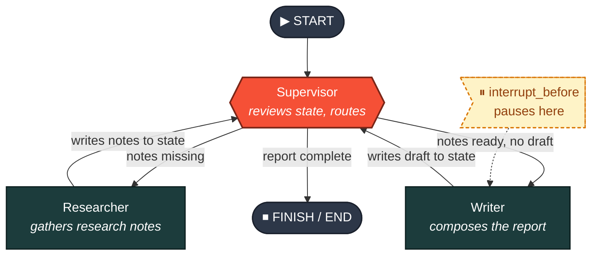
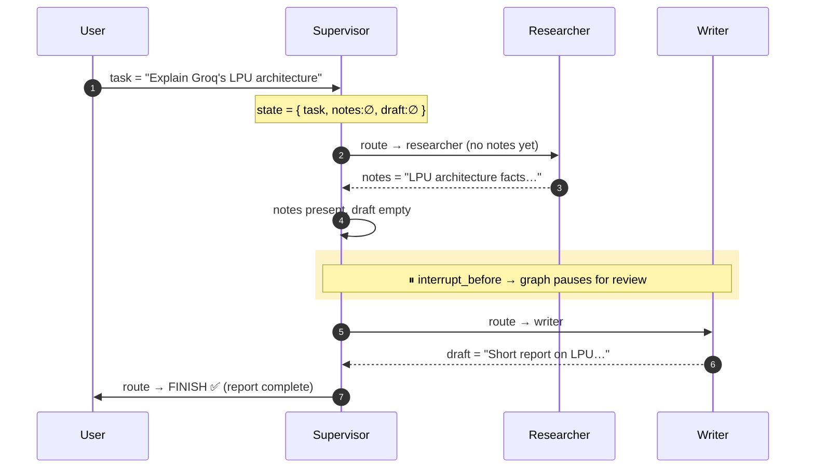

# 🤖 Multi-Agent Report Generator — LangGraph + Groq

> An autonomous multi-agent workflow where a **Supervisor** orchestrates a **Researcher** and a **Writer** to research a topic and produce a short report — built on LangChain's **LangGraph** and powered by **Groq's** ultra-fast LPU inference.

<p align="left">
  
  
  
  
</p>

---

## 📌 Overview

This project implements a **stateful agent graph** that loops until a report is complete. A single shared state object travels through the graph; each node reads it, does its job, and writes back. The **Supervisor** inspects that state on every turn and decides where control goes next — `researcher`, `writer`, or `FINISH`.

A deliberate `interrupt_before` checkpoint pauses the graph before the **Writer** runs, giving you a human-in-the-loop inspection point.

---

## 🏗️ Architecture

The graph is a supervisor-routed loop. The Supervisor is the only node that makes routing decisions; worker nodes always return control to it.



### Execution sequence (one full run)



### 🧩 Agent roles

| Agent | Responsibility | Reads from state | Writes to state |
|-------|----------------|------------------|-----------------|
| **Supervisor** | Central orchestrator — inspects the task, notes, and draft, then decides the next hop (`researcher` / `writer` / `FINISH`). | `task`, `notes`, `draft` | routing decision |
| **Researcher** | Gathers concise research notes for the given task using the LLM. | `task` | `notes` |
| **Writer** | Composes a short report/draft from the collected notes. | `task`, `notes` | `draft` |

---

## ⚙️ Setup

### 1. Install dependencies

```bash
pip install langchain-groq langgraph
```

### 2. Get a Groq API key

Generate a key from the [Groq Console](https://console.groq.com/keys).

- **Google Colab:** add it to the Secrets Manager (🔑 icon, left panel) under the name `GROQ_API_KEY` — the notebook picks it up automatically.
- **Local:** export it in your shell:

```bash
export GROQ_API_KEY="your_key_here"
```

### 3. Model selection

The LLM is initialized with `ChatGroq` using `llama-3.3-70b-versatile`:

```python
import os
from langchain_groq import ChatGroq

desired_model = "llama-3.3-70b-versatile"
os.environ["GROQ_API_KEY"] = userdata.get("GROQ_API_KEY")  # Colab secret
os.environ["GROQ_MODEL"] = desired_model

llm = ChatGroq(model=desired_model, temperature=0)
```

---

## ▶️ How to run

1. Ensure `GROQ_API_KEY` is set (Colab secret or environment variable).
2. Run all cells top to bottom.
3. Graph execution happens in the `main()` function.

```bash
# or, if exported as a script:
python main.py
```

---

## 📤 Output — start to finish

### Run trace

```text
--- STARTING GRAPH ---
Moving to: __start__
Supervisor is reviewing state...
  ↳ task    : "Explain Groq's LPU architecture"
  ↳ notes   : (empty)
  ↳ draft   : (empty)
Moving to: researcher
Researcher is gathering notes...
  ↳ notes captured ✓
Moving to: supervisor
Supervisor is reviewing state...

⏸  SYSTEM PAUSED. Next step is: ('writer',)
   Supervisor feedback: LPU architecture research notes exist,
   but no draft has been written yet.

--- RESUMING GRAPH ---
Moving to: writer
Writer is composing the report...
  ↳ draft captured ✓
Moving to: supervisor
Supervisor is reviewing state...
Moving to: FINISH

--- GRAPH COMPLETE ---
Diagram files saved in: output/
```

### Why the pause?

The graph is compiled with `interrupt_before=["writer"]`, so execution **halts before the Writer node** every run. This is a designed human-in-the-loop checkpoint — inspect the gathered notes, then resume to let the Writer produce the final report.

### Final report (excerpt)

```text
# Groq's LPU Architecture — Brief Report

Groq's Language Processing Unit (LPU) is a purpose-built inference engine
that prioritizes deterministic, low-latency execution over the throughput-
oriented design of general-purpose GPUs. Key points:

• Single-core, software-scheduled design eliminates the unpredictable
  scheduling overhead found in multi-core GPUs.
• Deterministic execution yields consistent token-by-token latency.
• On-chip memory locality reduces data-movement bottlenecks, enabling
  the high tokens-per-second rates Groq is known for.

In short, the LPU trades general-purpose flexibility for predictable,
high-speed sequential inference — ideal for LLM serving.
```

---

## 📁 Project structure

```text
.
├── main.py                       # Graph definition + main() entry point
├── requirements.txt
├── output/
│   └── multiagent_graph.png      # Rendered LangGraph diagram
└── README.md
```

> 💡 The PNG in `output/` is auto-generated by LangGraph (`graph.get_graph().draw_mermaid_png()`). The Mermaid diagrams above render directly on GitHub — no image file required.

---

## 🛠️ Tech stack

- **[LangGraph](https://langchain-ai.github.io/langgraph/)** — stateful, cyclic agent orchestration
- **[LangChain Groq](https://python.langchain.com/docs/integrations/chat/groq/)** — `ChatGroq` model wrapper
- **[Groq](https://groq.com/)** — `llama-3.3-70b-versatile` on LPU inference

---
