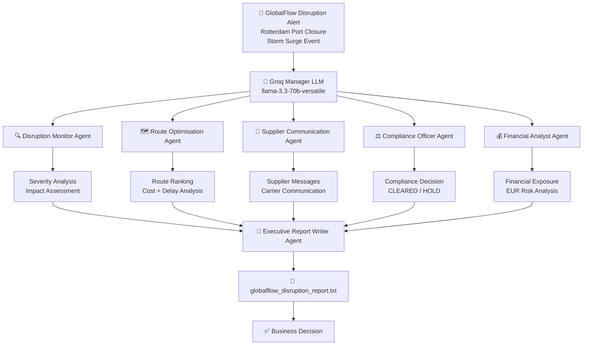

# 🌍 GlobalFlow Logistics
# Multi-Agent Supply Chain Disruption Response System

<p align="center">
  
  
  
  
</p>

---

## 🚀 Project Overview

GlobalFlow Logistics operates a global parcel network handling:

- **4 Million parcels/day**
- **38 countries**
- Multiple ocean, air, and road transportation routes

A disruption such as a port closure can cause:

- Shipment delays
- SLA penalties
- Increased logistics cost
- Compliance challenges
- Customer impact

This project builds an autonomous **AI Supply Chain Control Tower** using:

- CrewAI Multi-Agent Framework
- Groq LLM Inference
- Hierarchical AI Orchestration
- Context-based Task Dependency
- Long-Term Agent Memory
- Automated Executive Reporting

---

## 🎯 Business Objective

The AI system automatically:

✅ Detects supply-chain disruptions  
✅ Calculates severity and business impact  
✅ Generates optimised alternative routes  
✅ Communicates with suppliers  
✅ Validates compliance requirements  
✅ Calculates financial exposure  
✅ Generates executive-level reports  

---

## 🏗️ System Architecture



---

## 🤖 Multi-Agent System

### 1. Disruption Monitor Agent

**Role:** Supply Chain Intelligence Analyst

**Responsibilities:**
- Detect logistics disruptions
- Analyse severity and root cause
- Estimate operational impact
- Identify affected shipments

**Sample Output:**
```
SEVERITY: 8/10

Incident : Rotterdam Port Closure
Cause    : North Sea Storm Surge
Duration : 18–24 Hours
Affected : 340 Containers
Risk     : HIGH
```

---

### 2. Route Optimisation Agent

**Role:** Logistics Route Planning Specialist

**Responsibilities:**
- Analyse alternate routes
- Calculate delay hours
- Compare cost impacts
- Recommend the best option

**Sample Output:**

| Route       | Delay   | Cost Change | Risk   |
|-------------|---------|-------------|--------|
| Antwerp     | +3 hrs  | +2%         | Low    |
| Hamburg     | +5 hrs  | -6%         | Low    |
| Felixstowe  | +8 hrs  | -10%        | Medium |

> **Recommendation:** Antwerp Diversion — lowest operational risk with minimum delay.

---

### 3. Supplier Communication Agent

**Role:** Supplier Relationship Manager

**Responsibilities:**
- Draft supplier communications
- Coordinate emergency actions
- Request capacity confirmation

**Sample Output:**
```
Subject: Urgent Route Adjustment Required

Dear Supplier,

Due to Rotterdam port closure, GlobalFlow has activated
alternate shipping routes.

Please confirm capacity availability within 4 hours.

Regards,
GlobalFlow Operations
```

---

### 4. Compliance Officer Agent

**Role:** Global Trade Compliance Specialist

**Responsibilities:**
- Check customs requirements
- Validate transit country regulations
- Identify compliance risks

**Sample Output:**
```
COMPLIANCE STATUS: CLEARED

Checks:
  ✓ Customs Documentation
  ✓ Certificate of Origin
  ✓ Transit Regulations

Estimated Clearance: 6 Hours
```

---

### 5. Financial Analyst Agent

**Role:** Supply Chain Finance Specialist

**Responsibilities:**
- Calculate route change costs
- Estimate SLA penalties
- Assess insurance impact
- Quantify opportunity loss

**Sample Output:**
```
Financial Exposure Analysis

  Best Case  : EUR  2.5M
  Base Case  : EUR  7.8M
  Worst Case : EUR 14.0M

Recommended Reserve: EUR 8M
```

---

### 6. Executive Report Writer Agent

**Role:** Board-Level Crisis Communication Agent

**Output File:** `globalflow_disruption_report.txt`

**Report Structure:**
```
SITUATION
  What happened and why.

IMPACT
  Shipment volumes affected and financial exposure.

RESPONSE
  Selected recovery strategy and rationale.

NEXT STEPS
  1. [Owner] — [Action] — [Deadline]
  2. [Owner] — [Action] — [Deadline]
  3. [Owner] — [Action] — [Deadline]
```

---

## 🔄 Task Dependency Workflow

```
Task 1: Monitor Disruption
        │
        ▼
Task 2: Route Optimisation
        │
   ┌────┴────┐
   ▼         ▼
Task 3:   Task 4:
Supplier  Compliance
Comms     Validation
   │
   ▼
Task 5: Financial Analysis
        │
        ▼
Task 6: Executive Report
```

---

## 🧠 Memory Architecture

CrewAI memory is enabled across all agents:

```python
crew = Crew(
    agents=[...],
    tasks=[...],
    process=Process.hierarchical,
    manager_llm=groq_manager,
    memory=True
)
```

**Memory stores:**
- Previous disruption incidents
- Agent routing decisions
- Supplier response history
- Historical compliance outcomes

---

## ⚙️ Technology Stack

| Layer              | Technology              |
|--------------------|-------------------------|
| Agent Framework    | CrewAI                  |
| LLM Provider       | Groq                    |
| Reasoning Model    | llama-3.3-70b-versatile |
| Fast Model         | llama-3.1-8b-instant    |
| Orchestration      | Hierarchical Process    |
| Runtime            | Google Colab            |
| Language           | Python                  |
| Memory             | CrewAI Memory           |

---

## 📊 Sample Execution Output

```
[ALERT] Rotterdam Port Closed
Cause  : Storm Surge

Starting AI Crew...

[Monitor Agent]    → Severity: 8/10
[Router Agent]     → Recommended: Antwerp Diversion
[Compliance Agent] → Status: CLEARED
[Finance Agent]    → Exposure: EUR 7.8M
[Report Writer]    → Saved: globalflow_disruption_report.txt

✅ Execution Completed
```

---

## 🚀 Extensions Implemented

### Extension 1 — Financial Intelligence Agent

Added a dedicated Financial Analyst to provide:

```
Operational Intelligence  +  Financial Risk Analysis  =  Business Decision Support
```

### Extension 2 — Parallel Agent Execution

**Before (Sequential):**
```
Monitor → Router → Communication → Compliance → Report
```

**After (Parallel):**
```
         Monitor
            │
         Router
       ┌────┴────┐
  Communication  Compliance
       └────┬────┘
         Report
```

**Benefits:**
- Reduced total execution time
- Better scalability
- Lower end-to-end latency

### Extension 3 — Human Approval Workflow

```
AI Analysis → Human Review → Executive Report
```

Useful for high-value shipments, regulatory decisions, and customer escalations.

---

## 📁 Project Structure

```
GlobalFlow-AI/
│
├── globalflow_supply_chain.ipynb
├── globalflow_disruption_report.txt
├── crew_run.log
├── README.md
│
└── memory/
    └── crew_memory.db
```

---

## 🔮 Future Improvements

**Real-Time Data Integrations**
- Port tracking APIs (e.g., MarineTraffic)
- Weather disruption APIs
- Live shipping carrier feeds

**Advanced AI Capabilities**
- Predictive delay forecasting
- Cost optimisation engine
- Dynamic risk scoring models

**Enterprise Deployment**
- FastAPI service layer
- Docker containerisation
- Kubernetes orchestration
- Cloud platform deployment (Azure)

---

## 🏆 Final Outcome

This project demonstrates an autonomous AI supply-chain command center capable of:

✅ Detecting disruptions in real time  
✅ Coordinating multiple AI specialist agents  
✅ Optimising logistics routing decisions  
✅ Managing supplier communication  
✅ Ensuring regulatory compliance  
✅ Calculating financial exposure  
✅ Generating board-level executive reports  

---

<p align="center">
  <strong>Built with CrewAI + Groq + Multi-Agent AI Architecture</strong>
</p>
