# Amazon Marketplace MCP Architecture: Design Case Study

A comprehensive technical guide to designing an agentic architecture for Amazon sellers using the Model Context Protocol (MCP). This repository documents architecture decisions, trust boundaries, and implementation patterns for multi-server MCP orchestration.

**📅 June 2026 | Protocol Landscape v1.0**

---

## Table of Contents

1. [Executive Summary](#executive-summary)
2. [System Architecture](#system-architecture)
3. [Design Decision Framework](#design-decision-framework)
4. [Trust & Security Model](#trust--security-model)
5. [Data Flow Architecture](#data-flow-architecture)
6. [Human-in-the-Loop Pattern](#human-in-the-loop-pattern)
7. [Authorization Model](#authorization-model)
8. [Implementation Roadmap](#implementation-roadmap)
9. [Design Axes Resolution](#design-axes-resolution)
10. [Key Considerations](#key-considerations)

---

## Executive Summary

### The Challenge

Amazon sellers operating at scale need unified AI-driven operations across:
- **Pricing & inventory management**
- **FBA operations & restocks**
- **Advertising campaigns**
- **Order & return handling**
- **Buyer communication**
- **Profitability reconciliation**

These functions span disparate Amazon systems, creating a complex integration puzzle.

### The Solution

A **multi-server MCP-centric topology** with two trust boundaries:
- **Amazon-hosted**: Ads MCP Server (official, narrow scope)
- **Seller-controlled**: SP-API MCP Server (self-hosted or compliant vendor)

One orchestrating agent manages both, with human approval gates for financial decisions.

---

## System Architecture

### Reference Topology

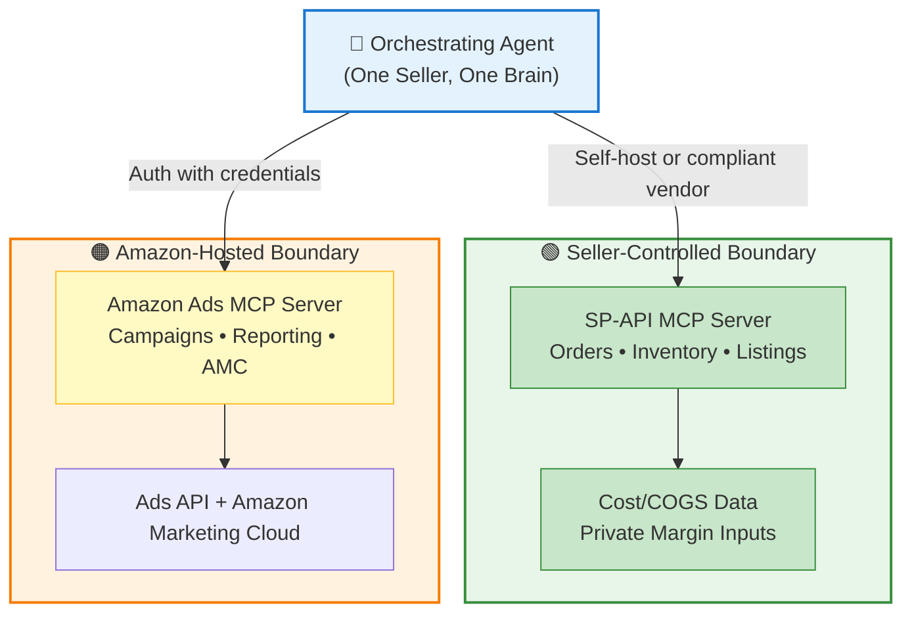

**Key Insight**: Two trust boundaries, not one. The division reflects data ownership and regulatory constraints, not just technical preference.

---

## Design Decision Framework

### The Decision Tree

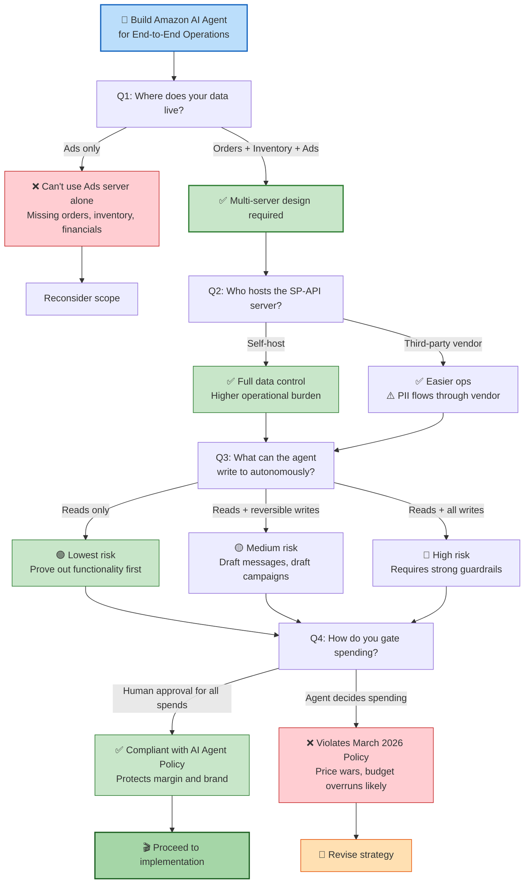

---

## Trust & Security Model

### Trust Boundary Resolution

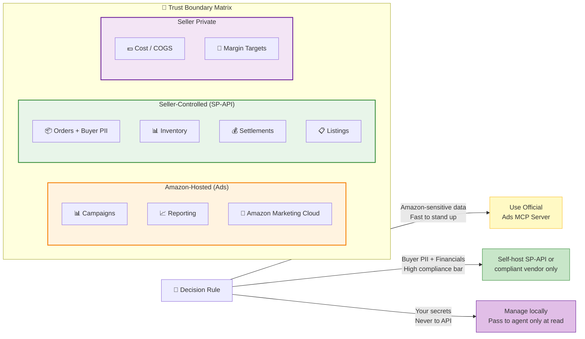

### Data Protection Strategy

| Data Type | Location | Authority | Risk Level |
|-----------|----------|-----------|-----------|
| **Campaigns, Spend, Reporting** | Amazon-hosted Ads MCP | Amazon | Low (Amazon-controlled) |
| **Orders, Buyer Names/Addresses** | Self-hosted SP-API or compliant vendor | Seller | **Critical** (PII) |
| **Inventory, Settlements** | Self-hosted SP-API or compliant vendor | Seller | High (Financial) |
| **COGS, Cost Data** | Seller private (never API) | Seller | Critical (Competitive) |

---

## Data Flow Architecture

### Read-Only Path (Autonomous)

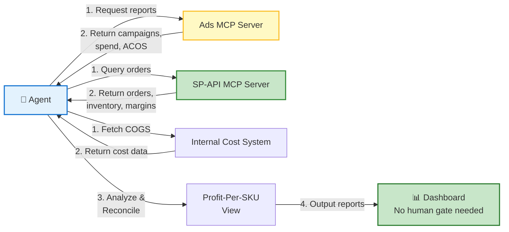

### Write Path (Gated)

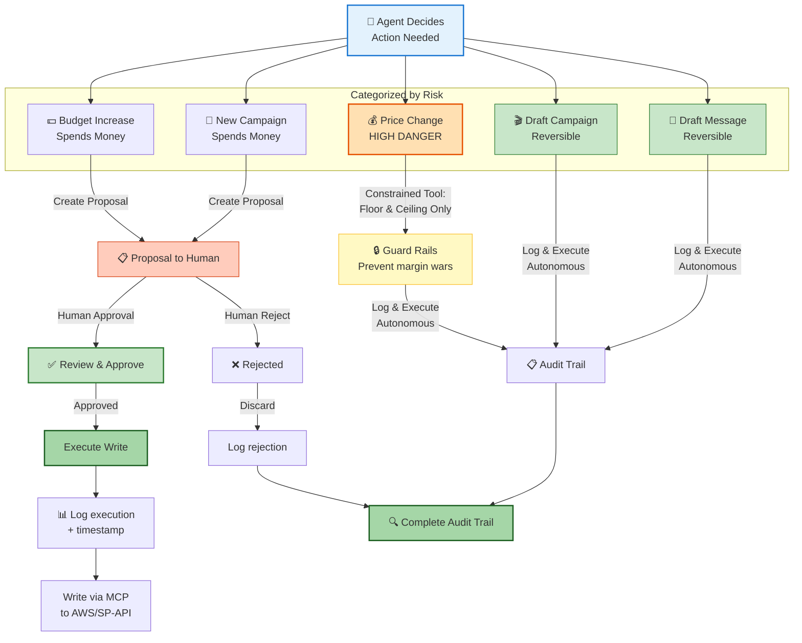

---

## Human-in-the-Loop Pattern

### Decision Gate by Operation Type

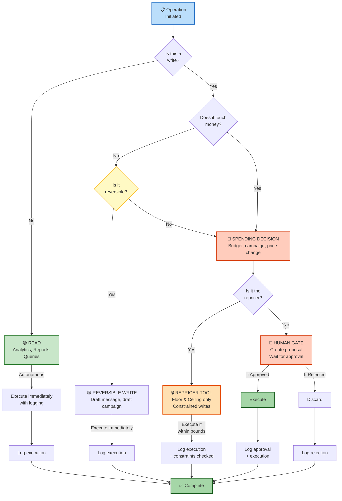

### Risk Levels by Operation

```
┌─────────────────────────────────────────────────────────────┐
│                    HUMAN-IN-LOOP FRAMEWORK                   │
├─────────────────────┬──────────────┬──────────┬─────────────┤
│ Operation Type      │ Risk Level   │ Autonomy │ Gating      │
├─────────────────────┼──────────────┼──────────┼─────────────┤
│ Read analytics      │ 🟢 NONE      │ Full     │ None        │
│ Report generation   │ 🟢 NONE      │ Full     │ None        │
│ Draft message       │ 🟡 REVERSIBLE│ Full     │ Audit log   │
│ Draft campaign      │ 🟡 REVERSIBLE│ Full     │ Audit log   │
│ Reprice            │ 🔴 CRITICAL  │ Partial  │ Constraints │
│ New campaign       │ 🔴 SPENDING   │ Propose  │ Human vote  │
│ Budget increase    │ 🔴 SPENDING   │ Propose  │ Human vote  │
│ Price change (free)│ 🔴 SPENDING   │ Propose  │ Human vote  │
│ Refund (Buy Box)   │ 🔴 BUY BOX    │ Propose  │ Human vote  │
└─────────────────────┴──────────────┴──────────┴─────────────┘
```

---

## Authorization Model

### Least-Privilege SP-API Roles

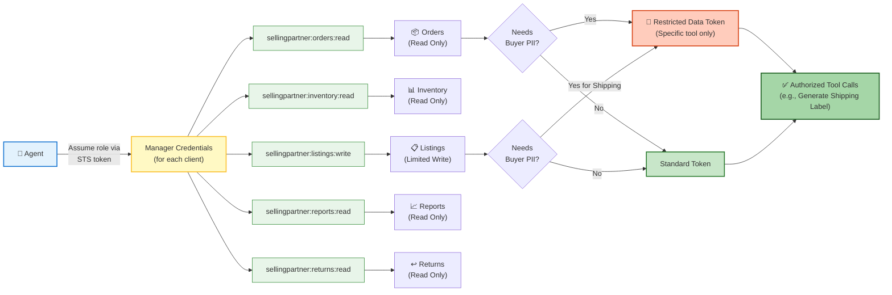

### Per-Client Isolation (Agency Model)

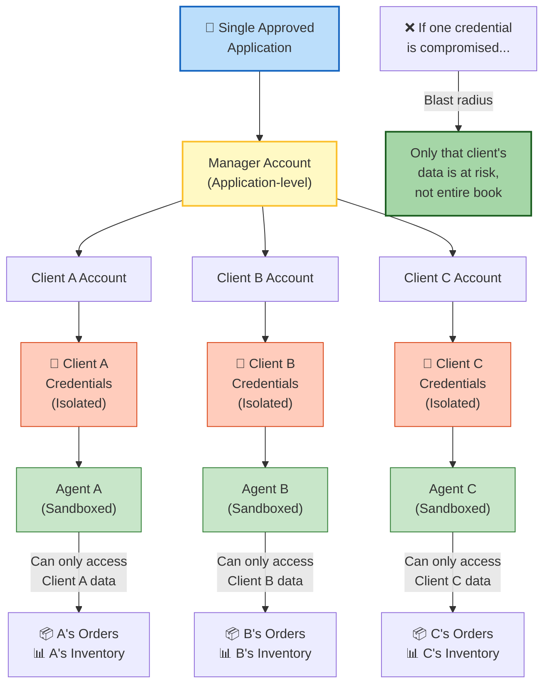

---

## Transport & Protocol Details

### JSON-RPC 2.0 Pattern

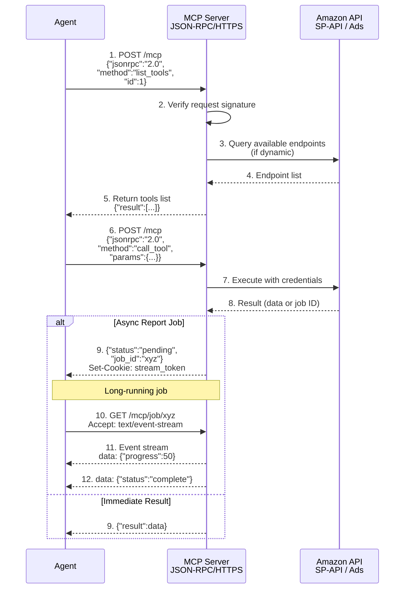

### Quota Management Pattern

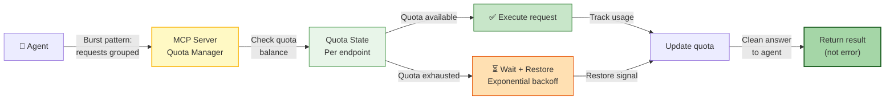

### Event Subscription Pattern (vs. Polling)

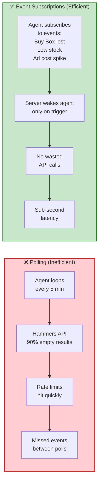

---

## Implementation Roadmap

### Staged Rollout Plan

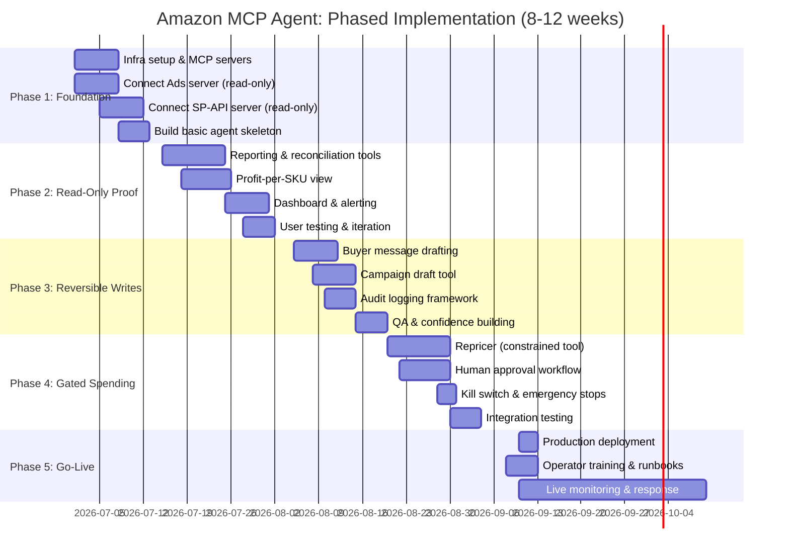

### Risk-Gated Milestones

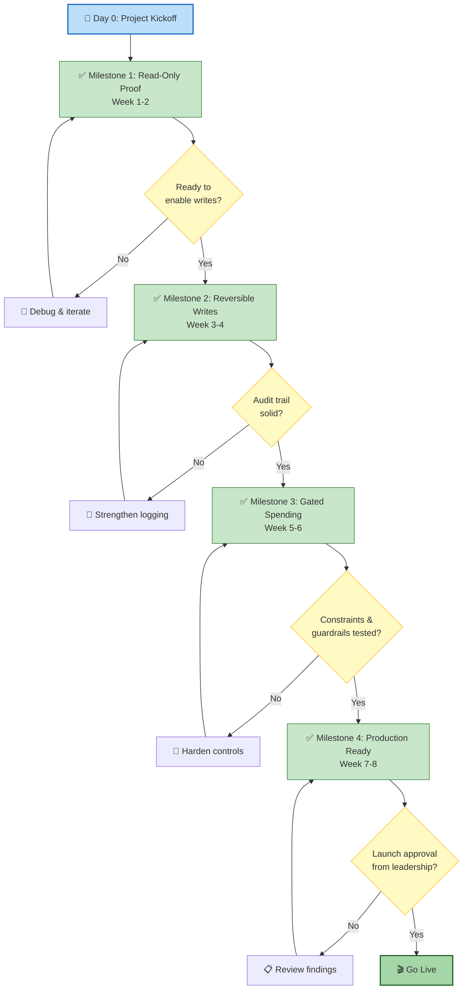

---

## Design Axes Resolution

### Summary Table

| Design Axis | Resolution | Rationale |
|---|---|---|
| **Topology** | MCP-centric, multi-server | One orchestrating agent; agencies fan out with per-client credential isolation |
| **Trust Boundary** | Ads → Amazon-hosted<br/>SP-API → Self-hosted or compliant vendor | Ads data stays in Amazon's boundary; buyer PII must not flow through third party |
| **Authorization** | Least-privilege SP-API roles<br/>RDT only for PII tools<br/>Per-client isolation | Minimize blast radius of credential compromise |
| **Human-in-Loop** | Reads autonomous<br/>Reversible writes auto-with-logging<br/>Money/Buy Box/pricing → human gate | Complies with March 2026 AI Agent Policy; protects margin and brand |
| **Transport & State** | JSON-RPC 2.0 over HTTPS<br/>Async report jobs<br/>Quota-aware throttling<br/>Event subscriptions > polling | Matches Amazon's native patterns; avoid rate limits and wasted API calls |
| **Discovery** | Static, pinned servers<br/>No dynamic registry | Security control; prevents prompt injection and look-alike tool attacks |
| **Profitability** | Join Amazon fee/return/ad data with seller's private COGS | Amazon cannot know your cost; real net margin requires data fusion |

---

## Key Considerations

### Security & Compliance

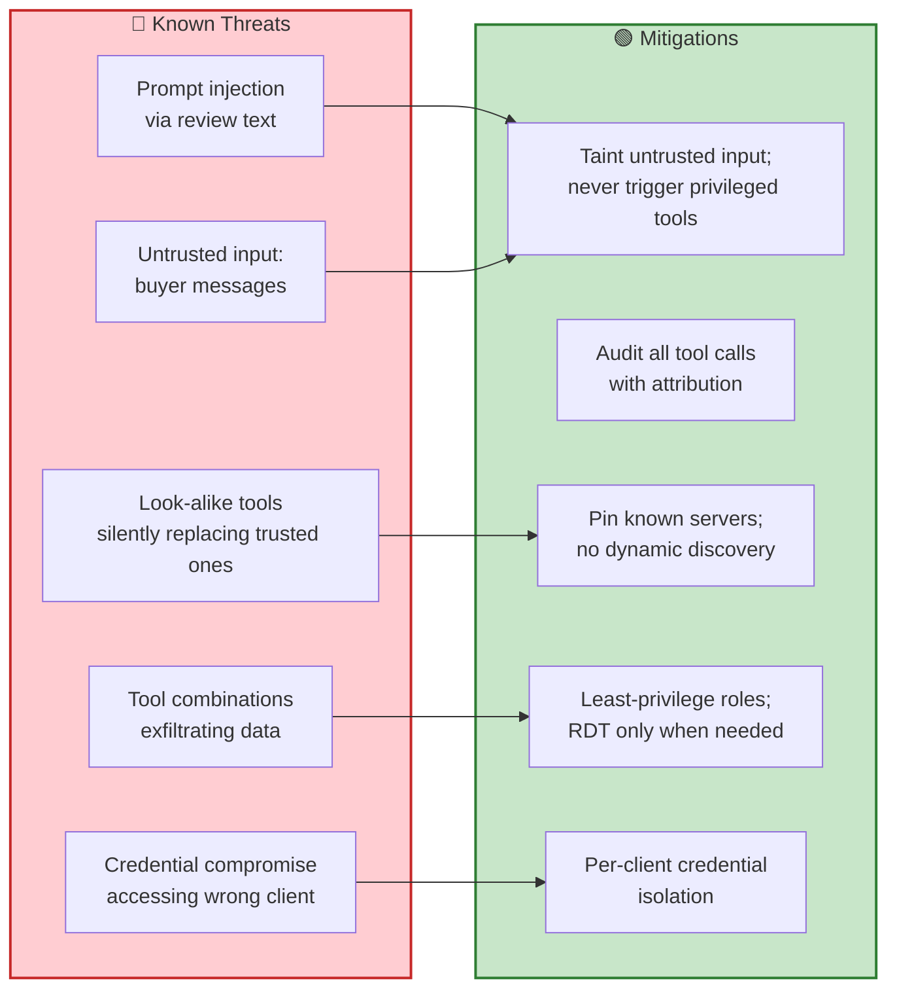

### Operational Runbooks

**If price war detected:**
- Repricer is constrained; cannot exceed ceiling
- Audit log shows who approved last price change
- Kill switch: disable pricing tool instantly
- Escalate to operator; human reviews competitor pricing

**If Buy Box lost:**
- Event subscription wakes agent
- Agent generates report: inventory, reviews, price vs. competitors
- Proposal sent to human (no autonomous action)
- Human reviews; approves inventory restock or price adjustment

**If rate limit hit:**
- Quota manager detects exhaustion
- Agent backs off exponentially; no error to user
- Server handles fan-out across multiple manager accounts (if agency)
- Operator gets alert; no SLA violation if quota increases available

**If credential compromised:**
- Blast radius limited to one client (agency) or one account (seller)
- Audit log shows what was accessed and when
- Revoke credential; rotate immediately
- Other clients unaffected

### Monitoring & Observability

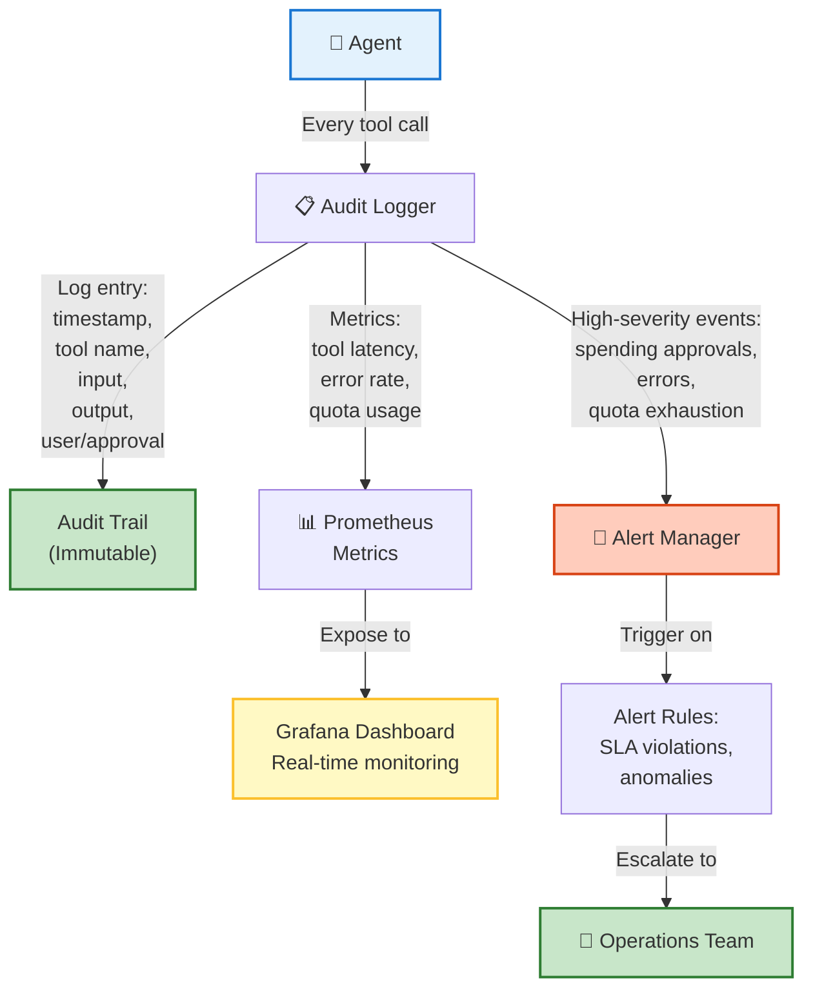

---

## Conclusion: From Design to Operations

This case study resolves the Amazon marketplace integration problem through a **multi-server MCP topology with clear trust boundaries, staged rollout, and human-in-the-loop gates on all financial decisions**.


### Key Takeaways

| Takeaway | Implementation |
|----------|---|
| **Trust boundaries exist for a reason** | Never route buyer PII through third-party MCP servers; self-host or pick a compliant vendor |
| **Human gates scale** | Design for humans to approve proposals, not monitor fine-grained decisions; gates should be exceptions, not the norm |
| **Audit trails are not optional** | Log every tool call with attribution; if something goes wrong, you need the history |
| **Constraints beat permissions** | Don't ask if the repricer *should* move price; build a tool that *cannot* move it outside safe bounds |
| **Events beat polling** | Subscribe to Amazon events (Buy Box lost, low stock, cost spike) rather than hammering endpoints |
| **Staged rollout wins** | Move from read-only → reversible writes → gated spending; each gate is a confidence checkpoint |

---
