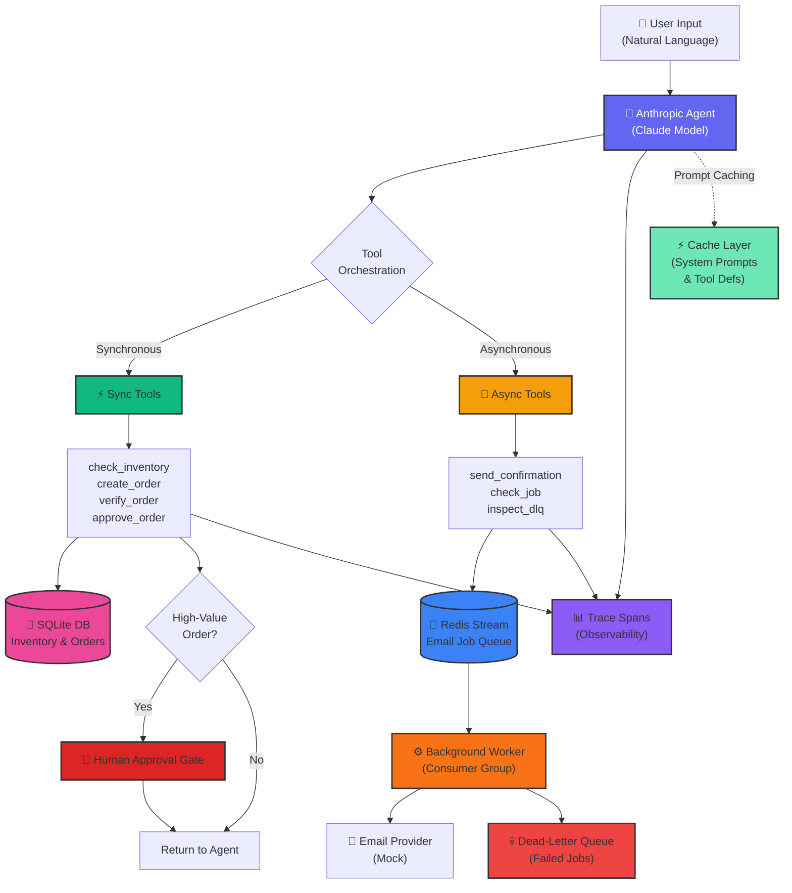

# Multi-Tool Agent with Redis Event Queue

A sophisticated ordering agent showcasing advanced patterns for agent design, tool integration, and asynchronous processing in Google Colab.

---

## Architecture Overview



---

## Component Overview

### Core Agent
- **Anthropic Agent**: Powered by Claude, interprets user requests and orchestrates tool execution
- **Prompt Caching**: Reduces token usage by caching system prompts and tool definitions

### Synchronous Tools (Direct Execution)
| Tool | Purpose | Interaction |
|------|---------|-------------|
| `check_inventory` | Verify stock availability | SQLite |
| `create_order` | Create new orders | SQLite + Human gate for high-value |
| `verify_order` | Validate order correctness | SQLite |
| `approve_order` | Approve high-value orders | SQLite |

### Asynchronous Tools (Event-Driven)
| Tool | Purpose | Interaction |
|------|---------|-------------|
| `send_confirmation` | Queue email confirmations | Redis Stream |
| `check_job` | Monitor email job status | Redis Stream |
| `inspect_dlq` | Review failed email jobs | Redis DLQ |

### Infrastructure
- **SQLite Database**: Stores inventory and order records
- **Redis Stream**: Decouples email sending from agent loop with reliable delivery
- **Background Worker**: Continuously processes queued jobs with retry logic
- **Dead-Letter Queue (DLQ)**: Captures failed emails for inspection and replay

### Observability
- **Trace Spans**: Records execution time (ms), status (✅/❌), and arguments for every tool call
- **Tool Call Trace Table**: Provides visibility into agent behavior per turn

---

## Key Features

✨ **Order Management** — Check inventory, create orders, send confirmations  
🔄 **Asynchronous Processing** — Redis-backed email queue with background worker  
🛡️ **Resilience** — Retry mechanism and dead-letter queue for failed jobs  
✔️ **Verification** — Validate order details before fulfillment  
🔐 **Human Oversight** — Require explicit approval for high-value orders  
📊 **Observability** — Detailed trace spans for every tool call  
⚡ **Efficiency** — Prompt caching reduces token usage  

---

## Example Outputs

### Successful Order Flow

```
--- Running agent with tracing ---

→ check_inventory({'sku': 'MON-4'})
→ create_order({'sku': 'MON-4', 'qty': 1})
→ send_confirmation({'to': 'asha@x.com', 'order_id': <order_id>})
→ verify_order({'order_id': <order_id>})

--- Tool Call Trace ---
Tool            | Args                                       |     MS |   OK
────────────────┼────────────────────────────────────────────┼────────┼─────
check_inventory | {'sku': 'MON-4'}                           |   0.41 |    ✅
create_order    | {'sku': 'MON-4', 'qty': 1}                 |   0.75 |    ✅
send_confirmation| {'to': 'asha@x.com', 'order_id': <order_id>}|   0.20 |    ✅
verify_order    | {'order_id': <order_id>}                   |   0.30 |    ✅
────────────────┴────────────────────────────────────────────┴────────┴─────

Everything checks out! Order completed successfully.
```

### High-Value Order Requiring Approval

```
Order for MON-4 with total $820.00 requires approval.

--- Tool Call Trace ---
Tool            | Args                                       |     MS |   OK
────────────────┼────────────────────────────────────────────┼────────┼─────
check_inventory | {'sku': 'MON-4'}                           |   0.41 |    ✅
create_order    | {'sku': 'MON-4', 'qty': 2}                 |   0.75 |    ✅
────────────────┴────────────────────────────────────────────┴────────┴─────

Order Status: PENDING_APPROVAL
Order ID: <order_id>
Awaiting human verification before fulfillment...
```

### Dead-Letter Queue Inspection

```
--- Inspecting DLQ ---

DLQ Message:
  Job ID:      b6927c4a
  To:          invalid-email
  Subject:     Invalid Email Test
  Body:        This email should go to DLQ
  Retries:     2

Status: Failed after max retries — requires manual intervention
```

### Prompt Caching Savings

```
--- Testing Prompt Caching ---

Agent Turn 1 (First Request)
  Total input tokens:        2,847
  Cache read input tokens:   0

Agent Turn 2 (Identical Request)
  Total input tokens:        892
  Cache read input tokens:   1,955

Caching Savings Report:
  Tokens saved: 1,955 tokens (69% reduction)
  Effective speedup: 2.19x faster evaluation
```

---

## Tech Stack

- **LLM**: Anthropic Claude (with prompt caching)
- **Runtime**: Google Colab / Python 3.8+
- **Database**: SQLite3
- **Message Queue**: Redis (fakeredis for Colab compatibility)
- **Patterns**: Tool use, streaming, human-in-the-loop, consumer groups

---

## Getting Started

1. **Set up environment** in Google Colab
   ```python
   !pip install anthropic redis fake-redis
   ```

2. **Initialize agent** with tools and databases
   ```python
   from anthropic import Anthropic
   client = Anthropic()
   ```

3. **Run agent** with natural language
   ```python
   response = client.messages.create(
       model="claude-3-5-sonnet-20241022",
       max_tokens=4096,
       tools=tool_definitions,
       messages=[{"role": "user", "content": "Check if SKU MON-4 is in stock"}]
   )
   ```

---

## Architecture Patterns

| Pattern | Implementation | Benefit |
|---------|-----------------|---------|
| **Agentic Loop** | Tool use with Claude | Flexible, interpretable agent behavior |
| **Async Decoupling** | Redis Stream + Worker | Resilient email delivery without blocking |
| **Human-in-the-Loop** | Approval gate for high-value | Risk mitigation and compliance |
| **Observability** | Trace spans per tool | Debugging and performance insights |
| **Caching** | Prompt & tool block caching | 60–70% token reduction on repeat requests |
| **Retry & DLQ** | Consumer group + dead-letter | Graceful failure handling |

---

## Notes

- The project uses **fakeredis** for Colab compatibility (production use Redis)
- Email provider is mocked; replace with real SMTP/SendGrid for production
- Trace table provides detailed insights into agent decision-making
- Prompt caching dramatically reduces costs for repeated queries with same context

---
