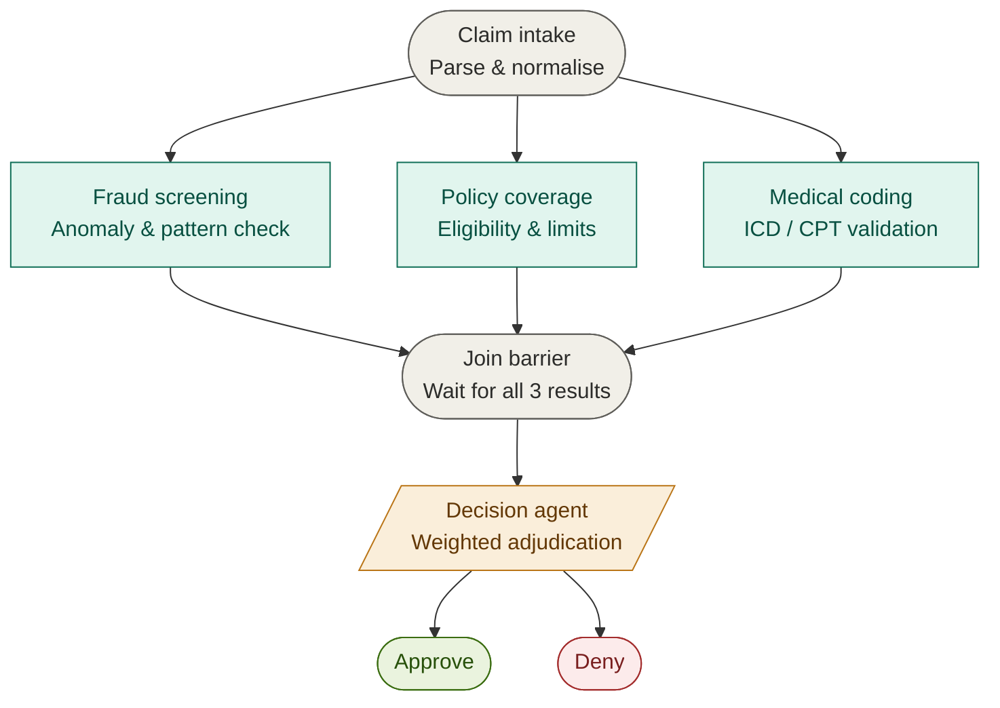
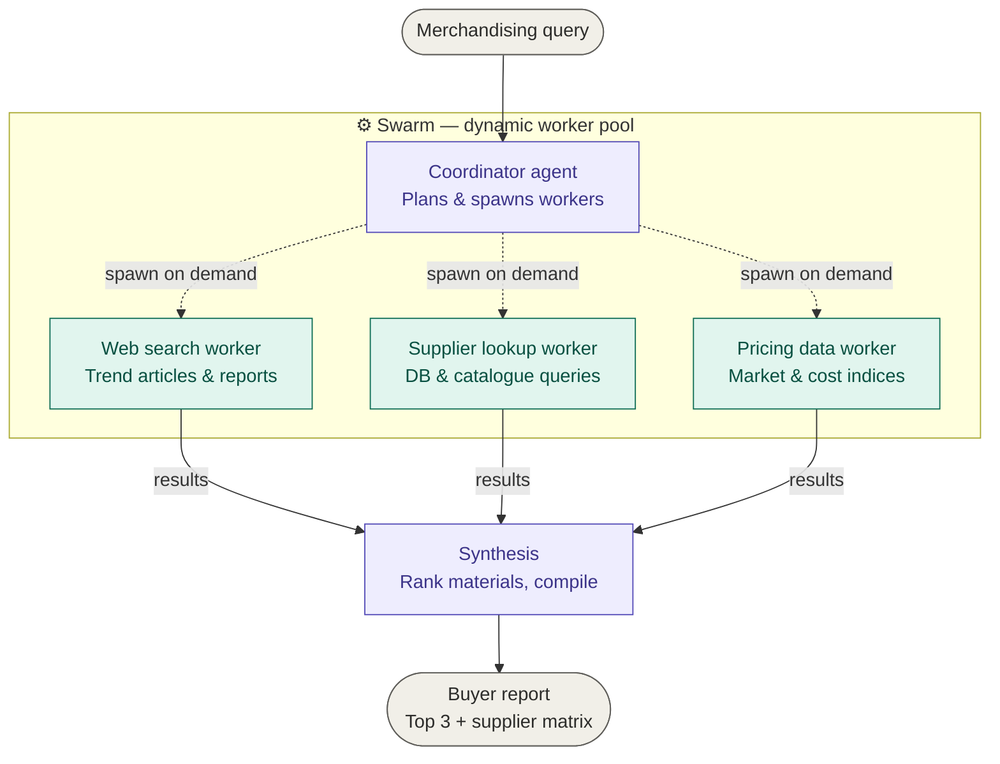

```mermaid
flowchart TD
  RFP([RFP brief]):::gray

  subgraph PIPELINE ["📋 Sequential specialist pipeline"]
    TA[Technical agent\nSolution & approach]:::teal
    PA[Pricing agent\nCost breakdown]:::teal
    CA[Compliance agent\nRegulatory & certs]:::teal
    TLA[Timeline agent\nMilestones & delivery]:::teal
    TA --> PA --> CA --> TLA
  end

  RFP --> TA
  TLA --> AS

  AS[Assembler\nMerge into draft]:::purple
  AS --> RV

  RV{Reviewer agent\nQuality & compliance gate}:::amber
  RV -->|pass| FS
  RV -.->|rework: technical| TA
  RV -.->|rework: pricing| PA
  RV -.->|rework: compliance| CA
  RV -.->|rework: timeline| TLA

  FS([Final sign-off\nSubmit RFP]):::green

  classDef teal   fill:#E1F5EE,stroke:#0F6E56,color:#085041,font-weight:500
  classDef purple fill:#EEEDFE,stroke:#534AB7,color:#3C3489,font-weight:500
  classDef amber  fill:#FAEEDA,stroke:#BA7517,color:#633806,font-weight:500
  classDef green  fill:#EAF3DE,stroke:#3B6D11,color:#27500A,font-weight:500
  classDef gray   fill:#F1EFE8,stroke:#5F5E5A,color:#2C2C2A,font-weight:500
```

# 🤖 AI Agent Orchestration Patterns — Enterprise Use Cases

> A detailed technical reference for selecting and implementing multi-agent orchestration patterns across three real-world enterprise scenarios: **Claims Adjudication**, **Buyer's Research Assistant**, and **RFP Response Builder**.
> 

---

## Overview

Multi-agent systems decompose complex tasks across specialized AI agents. Choosing the right **orchestration pattern** is critical — the wrong choice leads to unnecessary latency, unpredictable behavior, or brittle workflows.

This document covers three enterprise scenarios and justifies the orchestration pattern selected for each, with architecture diagrams, component breakdowns, and implementation guidance.

---

## Orchestration Patterns — Quick Reference

| Pattern | Structure | Best For | Task Type |
|---|---|---|---|
| **Round-robin** | Agents take turns in rotation | Load balancing identical agents | Homogeneous, stateless |
| **Selector** | Router picks one agent per task | Dynamic single-agent dispatch | Classification + routing |
| **Swarm / Handoff** | Coordinator spawns workers dynamically | Open-ended, emergent subtasks | Exploratory, unknown count |
| **GraphFlow** | Directed graph of nodes + edges | Fixed pipelines with known structure | Sequential or parallel DAGs |
| **Magentic** | LLM-driven planner with tool use | Autonomous, self-directed agents | Unstructured open-world tasks |

---

## Scenario 1 — Claims Adjudication

### Problem Statement

> A claim needs **three independent checks** — fraud screening, policy-coverage check, and medical-coding review — that can run at the same time. A final decision agent then combines all three results into an **approve** or **deny**.

### ✅ Selected Pattern: GraphFlow (Parallel Fan-out + Join)

### Why GraphFlow?

| Criteria | Assessment |
|---|---|
| Task structure known upfront? | ✅ Yes — always exactly 3 checks |
| Checks are independent? | ✅ Yes — no inter-check dependencies |
| All results required before decision? | ✅ Yes — hard join gate needed |
| Dynamic sub-task generation needed? | ❌ No |
| Self-directed agent reasoning needed? | ❌ No |

The three verification agents are **fixed**, **independent**, and must **all complete** before the decision agent can act. This is a textbook parallel DAG with a barrier node — GraphFlow's core strength.

**Why not the others?**

- **Round-robin** — assumes agents are interchangeable; these three have distinct specializations
- **Selector** — dispatches to one agent; we need all three simultaneously
- **Swarm** — for dynamic, unknown task counts; here the count is always 3
- **Magentic** — overkill; adds autonomous planning overhead to a deterministic pipeline

### Architecture



### Agent Responsibilities

#### 1. Claim Intake Node
- Parses raw claim payload (JSON / HL7 / EDI 837)
- Normalises fields: claimant ID, date of service, diagnosis codes, billed amounts
- Emits a structured `ClaimContext` object to all three agents simultaneously

#### 2. Fraud Screening Agent
- Runs statistical anomaly detection on billing patterns
- Cross-references claimant history for duplicate submissions
- Applies rule-based red flags (e.g. unbundling, upcoding, phantom billing)
- Outputs: `{ fraud_score: float, flags: string[], verdict: "clear" | "suspect" | "high_risk" }`

#### 3. Policy Coverage Agent
- Validates the claimant's active policy at date of service
- Checks procedure eligibility, deductibles, co-pay thresholds, exclusions
- Verifies network status of the provider
- Outputs: `{ covered: bool, coverage_pct: float, exclusion_reason: string | null }`

#### 4. Medical Coding Review Agent
- Validates ICD-10 diagnosis codes against CPT procedure codes
- Checks for code-pairing validity (LCD/NCD compliance)
- Flags upcoded, unbundled, or mutually exclusive codes
- Outputs: `{ coding_valid: bool, issues: string[], corrected_codes: string[] }`

#### 5. Join Barrier
- Holds execution until all three agent responses are received
- Timeout policy: if any agent exceeds `T_max`, escalate to human review queue
- Assembles a unified `AdjudicationBundle`

#### 6. Decision Agent
- Receives the full `AdjudicationBundle`
- Applies weighted decision logic:
  - `high_risk` fraud → auto-deny regardless of other results
  - `covered: false` → auto-deny with policy reason
  - `coding_valid: false` → pend for coding correction before approve
  - All clear → approve with audit trail
- Outputs a structured decision record with rationale for regulatory compliance

### GraphFlow Edge Definitions

```
claim_intake  --> fraud_screening      [parallel]
claim_intake  --> policy_coverage      [parallel]
claim_intake  --> medical_coding       [parallel]
fraud_screening    --> join_barrier    [result]
policy_coverage    --> join_barrier    [result]
medical_coding     --> join_barrier    [result]
join_barrier       --> decision_agent  [on: all_complete]
decision_agent     --> output          [terminal]
```

### Key Properties

- **Latency**: Total time ≈ `max(T_fraud, T_policy, T_medical) + T_decision` — not the sum
- **Fault tolerance**: Failed agent → route to human-in-the-loop queue (do not auto-decide)
- **Auditability**: Each agent persists its reasoning; decision is fully traceable
- **Compliance**: All three results are retained for regulatory audit (CMS, HIPAA)

---

## Scenario 2 — Buyer's Research Assistant

### Problem Statement

> A merchandising team asks: *"Find three trending materials for outdoor furniture this season and summarise supplier options."* The **number and type of sub-tasks isn't known in advance** and may need web search and data lookups.

### ✅ Selected Pattern: Swarm / Handoff

### Why Swarm?

| Criteria | Assessment |
|---|---|
| Sub-tasks known upfront? | ❌ No — materials discovered at runtime |
| Sub-task count fixed? | ❌ No — could be 3 materials or 5 |
| Tools needed vary per sub-task? | ✅ Yes — web search, DB lookup, pricing API |
| Coordinator needs to reason about findings? | ✅ Yes — synthesis step |
| Structure is a fixed graph? | ❌ No — emergent topology |

The coordinator doesn't know which materials to research until it starts searching. Worker agents are **spawned on demand** as materials are discovered, and each may invoke different tools. Swarm is built for exactly this emergent structure.

**Why not the others?**

- **GraphFlow** — requires the graph to be defined upfront; task topology here is dynamic
- **Selector** — dispatches to one agent at a time; parallelism and accumulation needed
- **Magentic** — valid alternative, but Swarm is leaner when the coordinator itself follows a clear loop: discover → delegate → collect → synthesise
- **Round-robin** — ignores specialisation; wrong tool

### Architecture



### Agent Responsibilities

#### 1. Coordinator Agent
- Receives the raw merchandising query
- Plans an initial research strategy (e.g. "search for outdoor furniture material trends Q2 2026")
- Determines which worker tools to invoke based on intermediate findings
- Accumulates worker results and decides when enough evidence is collected
- Drives the synthesis step

**Coordinator loop:**
```
while not enough_materials_found:
    spawn web_search_worker(query)
    evaluate results
    if new material found:
        spawn supplier_lookup_worker(material)
        spawn pricing_worker(material)
collect all results
synthesise report
```

#### 2. Web Search Worker
- Executes targeted web searches for trending materials
- Sources: trade publications, design trend reports, sustainability indices
- Extracts: material name, trend signals, adoption rate indicators
- Hands off: structured `MaterialSignal` objects to coordinator

#### 3. Supplier Lookup Worker
- Queried per discovered material
- Searches internal catalogue, supplier portals, and B2B databases
- Returns: supplier name, lead time, MOQ, geographic region, certifications
- Instantiated independently for each material (N workers for N materials)

#### 4. Pricing Data Worker
- Fetches current market price indices for each material
- Cross-references commodity pricing APIs and supplier price lists
- Returns: price range per unit, trend direction (↑↓→), seasonal variance

#### 5. Synthesis Step (Coordinator)
- Receives all `MaterialSignal` + `SupplierInfo` + `PricingData` tuples
- Ranks materials by composite score: trend strength × supplier availability × cost feasibility
- Formats final buyer report: top 3 materials with supplier comparison table

### Handoff Protocol

```
coordinator → worker:   TaskMessage { task_id, type, query, context }
worker → coordinator:   ResultMessage { task_id, status, data, confidence }
coordinator → output:   BuyerReport { materials[], suppliers{}, pricing{}, rationale }
```

### Key Properties

- **Flexibility**: Coordinator can spawn 0–N workers per material; adapts to query complexity
- **Tool diversity**: Each worker type carries its own tool set (search API, DB client, pricing API)
- **Partial results**: Coordinator can proceed with synthesis if a worker times out (graceful degradation)
- **Traceability**: All spawned tasks logged with task_id for audit and debugging

---

## Scenario 3 — RFP Response Builder

### Problem Statement

> A bid response has **four sections** (technical, pricing, compliance, timeline), each owned by a specialist and **assembled in order**. A reviewer then checks the assembled draft and may **send specific sections back for rework** before final sign-off.

### ✅ Selected Pattern: GraphFlow (Sequential Pipeline + Conditional Loop-back)

### Why GraphFlow?

| Criteria | Assessment |
|---|---|
| Section order is fixed? | ✅ Yes — technical → pricing → compliance → timeline |
| Sections are independent of each other? | ✅ Yes — each specialist owns one section |
| Reviewer can send sections back? | ✅ Yes — named conditional back-edges |
| Structure can be defined upfront? | ✅ Yes — deterministic graph |
| Dynamic task generation needed? | ❌ No |

The pipeline is ordered and deterministic. The reviewer's loop-back is a **conditional edge** to a named node — not arbitrary re-routing. GraphFlow handles this cleanly with conditional edge labels (`rework → section_X`).

**Why not the others?**

- **Swarm** — the structure is fully known; dynamic spawning adds unnecessary overhead
- **Magentic** — autonomous planning not needed; the graph is fully specified
- **Selector** — dispatches to one agent; we need sequential execution with state passing
- **Round-robin** — completely wrong; sections have distinct content and ownership

### Architecture



### Agent Responsibilities

#### 1. Technical Specialist Agent
- Authoring scope: solution architecture, methodology, team qualifications, past performance
- Inputs: RFP technical requirements section, company capability database
- Outputs: `TechnicalSection` — structured response with approach narrative and evidence
- Triggers next: passes output to Pricing Specialist on completion

#### 2. Pricing Specialist Agent
- Authoring scope: itemised cost breakdown, rate card, payment terms, ROI justification
- Inputs: RFP pricing requirements, cost model templates, vendor rate cards
- Outputs: `PricingSection` — structured tables + narrative
- Dependencies: may reference scope from `TechnicalSection` to price accurately

#### 3. Compliance Specialist Agent
- Authoring scope: regulatory certifications, standards adherence (ISO, SOC2, GDPR etc.), exceptions
- Inputs: RFP compliance checklist, company certification registry
- Outputs: `ComplianceSection` — requirement-by-requirement response matrix

#### 4. Timeline Specialist Agent
- Authoring scope: project milestones, delivery schedule, resource allocation, risk buffers
- Inputs: RFP delivery requirements, `TechnicalSection` scope, resource capacity data
- Outputs: `TimelineSection` — Gantt-style milestone breakdown with key dates

#### 5. Assembler Node
- Merges all four sections into a single coherent `RFPDraft` document
- Applies formatting template (headers, page numbers, TOC, executive summary wrapper)
- Runs inter-section consistency checks (e.g. pricing aligns with timeline milestones)
- Outputs: `RFPDraft` → Reviewer Agent

#### 6. Reviewer Agent
- Reads the full assembled draft against original RFP requirements
- Scores each section on: completeness, compliance, clarity, win-probability
- Decision logic:
  - All sections pass → route to Final Sign-off
  - One or more sections fail → emit `ReworkRequest { section_id, feedback, priority }`
- Loop-back edges are **named and conditional** — only flagged sections re-enter their specialist agent

#### 7. Final Sign-off Node
- Human or automated approval checkpoint
- Validates document integrity (page count, required attachments, submission format)
- Submits to procurement portal or packages for delivery

### GraphFlow Edge Definitions

```
technical_agent  --> pricing_agent     [sequential]
pricing_agent    --> compliance_agent  [sequential]
compliance_agent --> timeline_agent    [sequential]
timeline_agent   --> assembler         [sequential]
assembler        --> reviewer          [sequential]

reviewer --> final_signoff             [on: all_pass]
reviewer --> technical_agent           [on: rework, section="technical"]
reviewer --> pricing_agent             [on: rework, section="pricing"]
reviewer --> compliance_agent          [on: rework, section="compliance"]
reviewer --> timeline_agent            [on: rework, section="timeline"]
```

### Rework Loop Behaviour

```
ReworkRequest {
  section_id:  "pricing" | "technical" | "compliance" | "timeline"
  feedback:    string           # specific reviewer notes
  priority:    "minor" | "major"
  max_cycles:  3                # hard limit before escalation to human
}
```

- Rework cycles are tracked per section to prevent infinite loops
- After `max_cycles` rework attempts, the section is escalated to a human editor
- Each rework iteration appends to the section's revision history for audit

### Key Properties

- **Ordered execution**: Sequential pipeline ensures each specialist can reference prior sections
- **Targeted rework**: Only failing sections loop back — passing sections are not re-generated
- **Loop guard**: `max_cycles` prevents runaway rework chains
- **Deterministic graph**: Entire topology is known at design time; easy to test and monitor
- **Human escalation path**: Built-in escalation at rework limit and at final sign-off

---

## Pattern Comparison Matrix

| Dimension | Claims Adjudication | Buyer's Research | RFP Builder |
|---|---|---|---|
| **Pattern** | GraphFlow (parallel + join) | Swarm / Handoff | GraphFlow (sequential + loop-back) |
| **Task structure** | Fixed, parallel | Dynamic, emergent | Fixed, sequential |
| **Sub-task count** | Always 3 | Unknown at start | Always 4 |
| **Agent specialisation** | High | Medium | High |
| **Loops / cycles** | None | None (coordinator loop) | Conditional back-edges |
| **Human-in-loop point** | Join timeout | None by default | Final sign-off + rework limit |
| **Latency profile** | `max(T_agents)` | `sum(T_waves)` | `sum(T_sections) + T_review` |
| **State passing** | Claim context (broadcast) | Task messages | Section documents (sequential) |
| **Failure mode** | Agent timeout → human queue | Worker timeout → partial report | Rework limit → human escalation |

---
