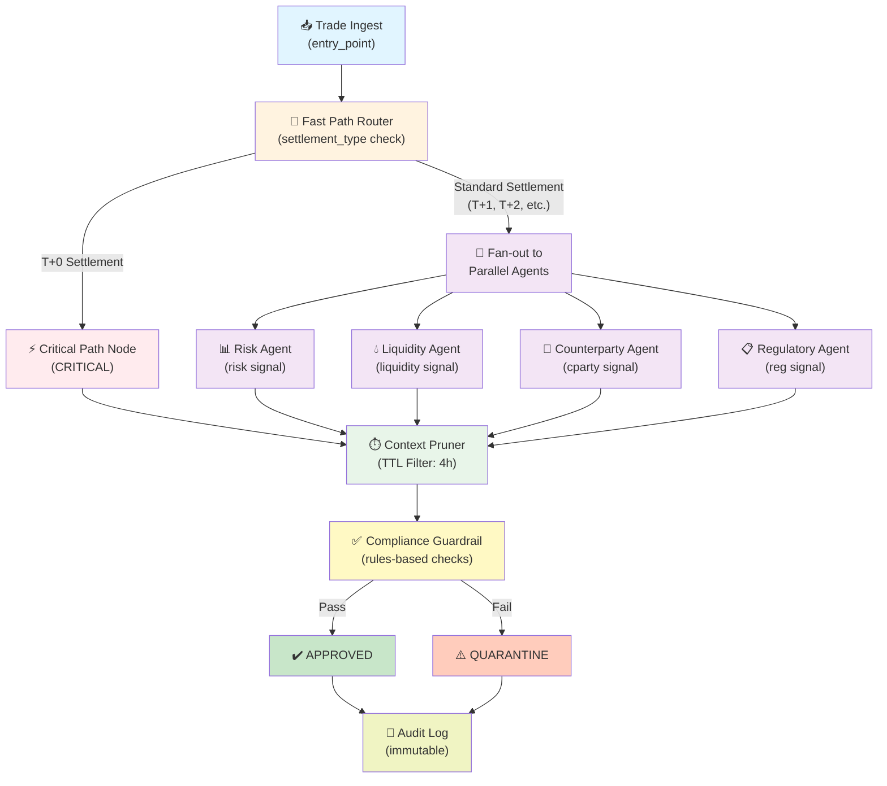

# Financial Trade Processing Architecture

This document outlines a system designed for processing financial trades, focusing on speed, compliance, and risk management. The architecture leverages a graph-based approach (likely using `langgraph`) to define a stateful workflow where trades are ingested, routed through various analyst agents, and ultimately assessed for compliance.

## Architecture Diagram



## Key Components:

### 1. `TradeState` (TypedDict)
This dictionary defines the immutable state of a trade as it progresses through the system. It captures all relevant information and acts as the central data structure for the workflow.

*   **`trade_id`**: Unique identifier for the trade.
*   **`trade_data`**: A dictionary containing details like `type`, `amount`, `currency`, `counterparty`, and `settlement_type`.
*   **`signals`**: An accumulated list of signals generated by various parallel agents.
*   **`active_signals`**: Signals that are still relevant within a defined time-to-live (TTL).
*   **`compliance_passed`**: A boolean indicating whether the trade passed all compliance checks.
*   **`compliance_notes`**: A list of reasons if compliance checks failed.
*   **`urgency`**: Categorizes the trade's urgency (e.g., CRITICAL, STANDARD, QUARANTINE).
*   **`decision`**: The final decision made regarding the trade.
*   **`audit_log`**: An immutable chronological log of actions and events related to the trade.

### 2. `timed` Decorator
A utility decorator used to measure the execution latency of functions (nodes in the graph). It records the time taken for each function call, which is crucial for performance monitoring.

### 3. Ingestion and Fast-Path Check (`trade_ingest`, `fast_path_router`, `critical_path_node`)

*   **`trade_ingest`**: The entry point for new trade data. It logs the incoming trade and initializes the `signals` and `audit_log`.
*   **`fast_path_router`**: Determines the routing logic based on the trade's `settlement_type`. 
    *   **T+0 Settlement**: Trades with T+0 settlement (immediate settlement) are routed to a `critical_path_node` to bypass extensive enrichment for speed.
    *   **Standard Settlement**: Other settlement types are fanned out to multiple parallel analyst agents.
*   **`critical_path_node`**: Handles T+0 trades, marking them as `CRITICAL` and requiring human intervention without further LLM or enrichment processing.

### 4. Parallel Analyst Agents
These agents operate in parallel for standard path trades, each focusing on a specific aspect of trade analysis. They generate `signals` that are collected in the `TradeState`.

*   **`risk_agent`**: Assesses the risk level of a trade based on its amount and generates a risk signal.
*   **`liquidity_agent`**: Checks if sufficient liquidity is available to cover the trade amount, generating a liquidity signal.
*   **`cparty_agent`**: Validates the counterparty against an approved list, producing a counterparty signal.
*   **`reg_agent`**: Performs regulatory checks (e.g., MiFID II pre-trade reporting requirements for derivatives), generating a regulatory signal.

### 5. Context Pruner (`context_pruner`)
This component filters the collected `signals` based on a Time-To-Live (TTL). Signals older than 4 hours (14400 seconds) are considered irrelevant and pruned, ensuring only active and timely information is used for subsequent steps.

### 6. Compliance Guardrail (`compliance_guardrail`)
A deterministic, rules-based system that evaluates the `active_signals` to determine the trade's compliance status. It does not use an LLM, ensuring predictable outcomes. It checks for:

*   Approved counterparty.
*   No regulatory reporting breaches.
*   Sufficient liquidity coverage (1.2x).

## Data Flow Summary

| Stage | Component | Input | Output | Decision Point |
|-------|-----------|-------|--------|-----------------|
| **1. Ingestion** | `trade_ingest` | Raw trade data | Initialized `TradeState` | — |
| **2. Routing** | `fast_path_router` | `settlement_type` | Route to critical or standard path | Is it T+0? |
| **3. Analysis** | Parallel agents | Trade data | Multiple signals | — |
| **4. Filtering** | `context_pruner` | All signals | Active signals (< 4h TTL) | — |
| **5. Compliance** | `compliance_guardrail` | Active signals | Decision + notes | APPROVED or QUARANTINE? |
| **6. Audit** | `audit_log` | All events | Immutable log | — |

## Example Test Trades (`TEST_TRADES`)
A list of example trade data used to test different paths and scenarios within the system:

1.  **`T001`**: A high-value FX_SPOT trade with T+0 settlement, designed to trigger the **CRITICAL fast path**.
2.  **`T002`**: A standard EQUITY trade with T+2 settlement, designed to follow the **Standard path** through all analyst agents.
3.  **`T003`**: A very high-value DERIVATIVE trade with an unapproved counterparty and T+2 settlement, designed to trigger **compliance failures** and potentially lead to quarantine.

## Workflow Execution Paths

### Path A: Fast Track (T+0 Trades)
```
Trade Ingest → Fast Path Router (T+0) → Critical Path Node → Context Pruner → Compliance Guardrail → Decision
```
**Characteristics**: Minimal agent processing, high-priority flag, requires human review.

### Path B: Standard Track (T+1, T+2, etc.)
```
Trade Ingest → Fast Path Router (T+1/2) → [Parallel Agents] → Context Pruner → Compliance Guardrail → Decision
```
**Characteristics**: Full multi-agent analysis, comprehensive signal collection, rule-based compliance check.
