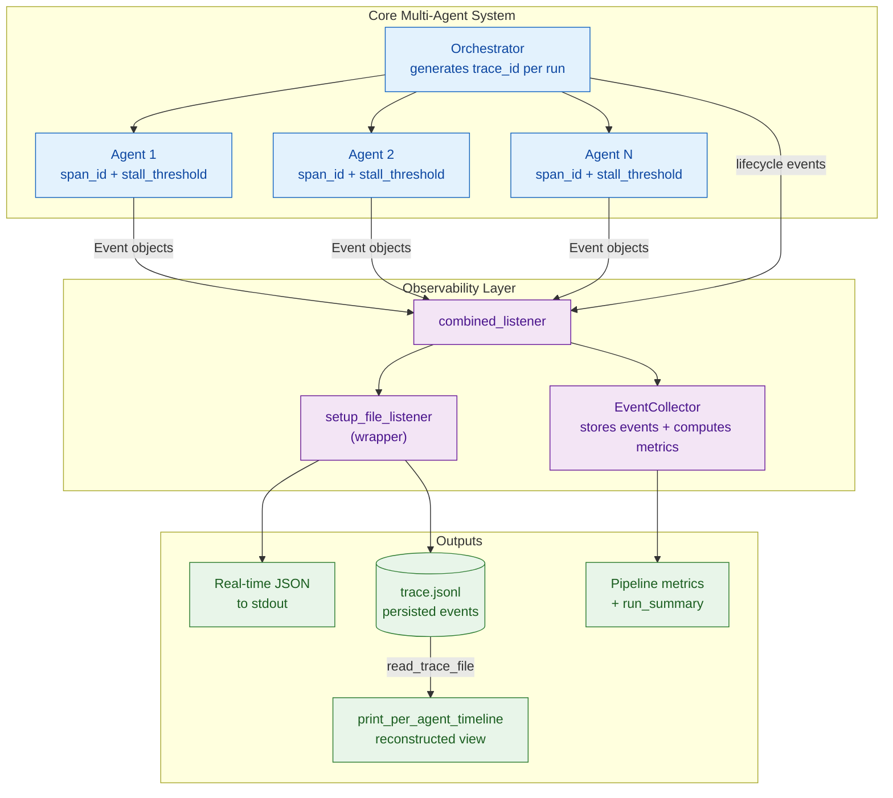
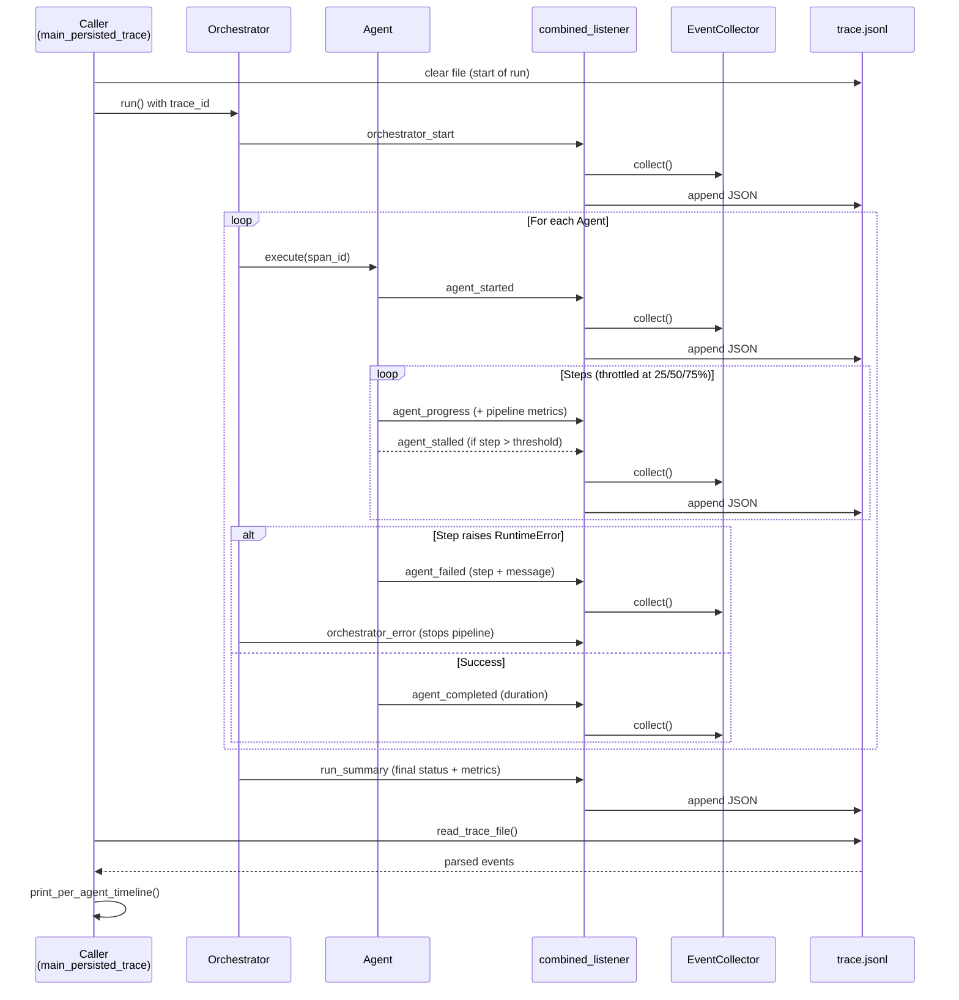
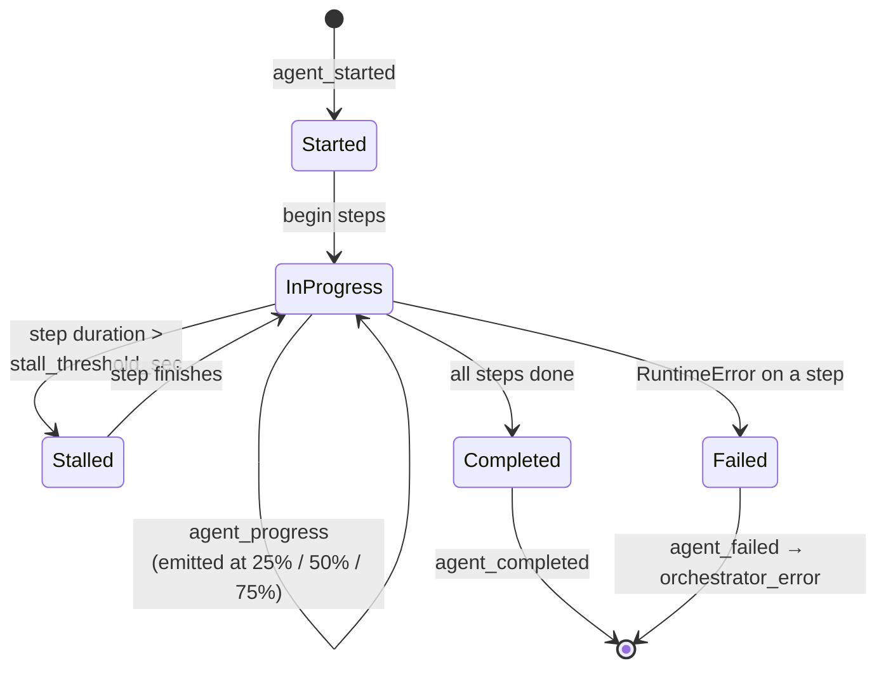
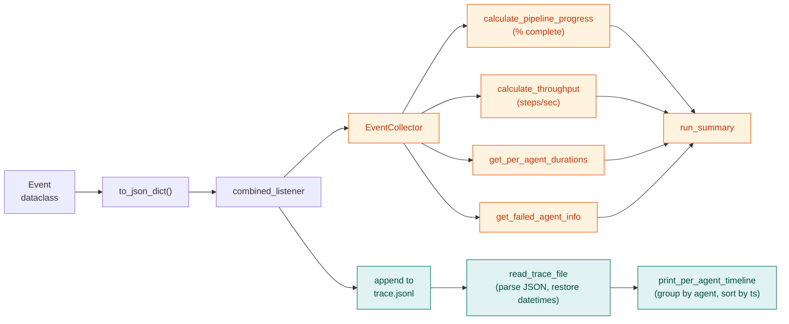
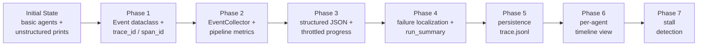
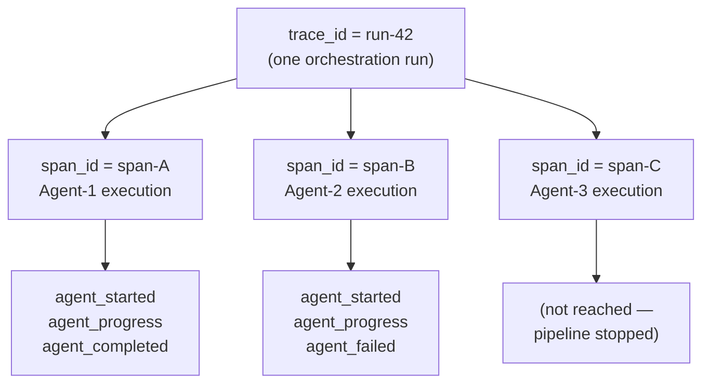

# Multi-Agent System with Enhanced Observability

A simulated multi-agent system instrumented with a progressively-built observability layer. What begins as a handful of agents printing unstructured log lines evolves — across seven phases — into a fully traced pipeline with correlated structured events, live metrics, failure localization, durable persistence, timeline reconstruction, and stall detection.

---

## Table of Contents

- [Why This Project Exists](#why-this-project-exists)
- [Feature Highlights](#feature-highlights)
- [System Architecture](#system-architecture)
- [Event Flow (End to End)](#event-flow-end-to-end)
- [Agent Lifecycle](#agent-lifecycle)
- [Observability Data Pipeline](#observability-data-pipeline)
- [Core Components](#core-components)
- [Event Types Reference](#event-types-reference)
- [The Event Schema](#the-event-schema)
- [Evolution by Phase](#evolution-by-phase)
- [Correlation Model: trace_id vs span_id](#correlation-model-trace_id-vs-span_id)
- [Persistence Format (`trace.jsonl`)](#persistence-format-tracejsonl)
- [How to Run](#how-to-run)
- [Future Enhancements](#future-enhancements)

---

## Why This Project Exists

Multi-agent systems are hard to debug because work happens concurrently, failures cascade, and "what actually happened" is scattered across stdout. This project demonstrates how to layer observability onto such a system **incrementally**, so that at any point you can answer:

- *How far along is the pipeline, and how fast is it going?*
- *Which agent failed, on which step, and why?*
- *What was the exact ordering of events for a given agent?*
- *Did any agent hang or stall on a step?*

Every answer is backed by **structured, correlated, persisted events** rather than ad-hoc print statements.

---

## Feature Highlights

| Capability | Description |
|---|---|
| **Event Correlation** | Every event carries a `trace_id` (per run) and `span_id` (per agent execution). |
| **Structured Events** | All output is JSON — machine-parseable, not free text. |
| **Pipeline Metrics** | Live percent-complete, throughput (steps/sec), and per-agent durations. |
| **Failure Diagnostics** | Pinpoints the failed agent, the failing step, and the error message. |
| **Event Persistence** | Every event is appended to `trace.jsonl` for post-run analysis. |
| **Timeline Visualization** | Reconstructs and prints a per-agent timeline from the persisted trace. |
| **Stall Detection** | Flags any step that exceeds a configurable duration threshold. |

---

## System Architecture

The system has three logical layers: the **core agents**, the **observability fan-out**, and the **outputs** derived from events.



**Reading the diagram:** Agents and the orchestrator emit `Event` objects to a single `combined_listener`. That listener fans out to (a) the `EventCollector` for live metric computation and (b) the file listener wrapper, which both prints JSON to stdout and appends to `trace.jsonl`. After the run, `read_trace_file` replays the persisted trace into `print_per_agent_timeline`.

---

## Event Flow (End to End)

This sequence shows the path of events during a single run, from orchestration start through to the reconstructed timeline.



---

## Agent Lifecycle

Each agent moves through a small set of states. Progress events are **throttled** to the 25%, 50%, and 75% thresholds to avoid log spam, and a long step triggers a `agent_stalled` warning without halting the agent.



> **Note:** `agent_stalled` is a *warning*, not a terminal state. The step that stalled still counts toward pipeline progress (the `EventCollector.collect` method was updated to include `agent_stalled` events when advancing `steps_finished`).

---

## Observability Data Pipeline

How a raw event becomes both a live metric and a durable, replayable record.



---

## Core Components

### `Event` (dataclass)
The atomic unit of observability. Carries the timestamp, event type, owning agent, correlation IDs, and contextual payload (duration, status, message, step counters). Exposes `to_json_dict()` for structured serialization.

### `Agent`
Simulates work by pausing a random duration per step. Each agent:
- receives a `span_id` for its execution,
- emits lifecycle and progress events through the listener,
- supports a `stall_threshold_sec` (default **0.3s**) and emits `agent_stalled` when a step exceeds it.

### `Orchestrator`
Owns the run. Generates the `trace_id`, executes agents sequentially, catches `RuntimeError` from any agent to emit `orchestrator_error` and stop the pipeline, and finishes by emitting the `run_summary`.

### `EventCollector`
The metrics brain. Stores every event and computes:
- `calculate_pipeline_progress` — overall percent complete + total completed steps,
- `calculate_throughput` — steps processed per second across the pipeline,
- `get_per_agent_durations` — execution time per agent,
- `get_failed_agent_info` — failure localization (the source of the `KeyError: 'span_id'` fix in Phase 4).

### Listeners & Persistence helpers
- `progress_listener` — the original simple printer.
- `combined_listener` — the fan-out hub.
- `setup_file_listener` — wraps the combined listener to also append to `trace.jsonl` and clears the file at run start.
- `read_trace_file` — parses `trace.jsonl` back into Python dicts (restoring `datetime` objects).
- `print_per_agent_timeline` — reconstructs a human-readable, per-agent timeline.

---

## Event Types Reference

| Event Type | Emitted By | Meaning |
|---|---|---|
| `orchestrator_start` | Orchestrator | A new run has begun. |
| `agent_started` | Agent | An agent has begun executing. |
| `agent_progress` | Agent | Progress update — throttled to 25% / 50% / 75%; enriched with pipeline metrics. |
| `agent_stalled` | Agent | A single step exceeded `stall_threshold_sec` (warning). |
| `agent_completed` | Agent | An agent finished all steps successfully. |
| `agent_failed` | Agent | An agent hit an error; captures agent, step, and message. |
| `orchestrator_error` | Orchestrator | A `RuntimeError` was caught; the pipeline is stopped. |
| `run_summary` | Orchestrator | Final report: status, total duration, completed agents, failure details, metrics, per-agent durations. |

---

## The Event Schema

Each `Event` serializes (via `to_json_dict`) to a flat JSON object. Representative fields:

```jsonc
{
  "timestamp": "2026-06-24T10:15:32.481000",
  "event_type": "agent_progress",
  "agent_name": "Agent-2",
  "trace_id": "a1b2c3d4-...",          // same for all events in a run
  "span_id": "e5f6g7h8-...",           // same for all events of one agent
  "duration": 0.142,                    // present on completion / stall
  "status": "in_progress",
  "message": "crossed 50% threshold",
  "step": 3,
  "total_steps": 6,
  "pipeline_percent_complete": 41.7,    // enrichment (Phase 2)
  "pipeline_throughput_steps_per_sec": 7.3
}
```

---

## Evolution by Phase

The system was built up one capability at a time. Each phase is independently meaningful.



**Phase 1 — Event Definition & Correlation.** Introduced the `Event` dataclass and the `trace_id` / `span_id` correlation identifiers; updated `Agent` and `Orchestrator` to generate and pass them with every event.

**Phase 2 — Event Collection & Pipeline Metrics.** Added `EventCollector` to store events and compute pipeline progress, throughput, and per-agent durations. `agent_progress` events were enriched with pipeline-level metrics.

**Phase 3 — Structured Lifecycle Events & Throttling.** Standardized the event-type vocabulary, switched all stdout output to JSON, and throttled `agent_progress` to the 25/50/75% thresholds.

**Phase 4 — Failure Localization & Run Summary.** Added the `agent_failed` event, graceful `RuntimeError` handling in the orchestrator (`orchestrator_error`), and a comprehensive `run_summary`. Fixed a `KeyError: 'span_id'` in `get_failed_agent_info`.

**Phase 5 — Event Persistence.** Every event is now appended to `trace.jsonl` (one JSON object per line). `setup_file_listener` clears the file at run start; `read_trace_file` reads it back.

**Phase 6 — Per-Agent Timeline Visualization.** `print_per_agent_timeline` groups persisted events by agent (including the orchestrator), sorts by timestamp, and prints a readable timeline with per-event-type formatting.

**Phase 7 — Stall Detection.** Added `Agent.stall_threshold_sec` (default 0.3s) and the `agent_stalled` event. The timeline marks stalls with a `WARNING` prefix, and the `EventCollector` counts stalled steps toward progress.

---

## Correlation Model: `trace_id` vs `span_id`



- **`trace_id`** groups *everything* that happened in one run.
- **`span_id`** groups *everything one agent did* within that run.

Together they let you filter the trace from "the whole run" down to "exactly what Agent-2 did" without ambiguity.

---

## Persistence Format (`trace.jsonl`)

`trace.jsonl` is a [JSON Lines](https://jsonlines.org/) file — one complete JSON object per line, appended as events occur. This format is append-friendly, streamable, and trivially parsed line by line:

```
{"event_type": "orchestrator_start", "trace_id": "run-42", ...}
{"event_type": "agent_started", "agent_name": "Agent-1", "span_id": "span-A", ...}
{"event_type": "agent_progress", "agent_name": "Agent-1", "step": 2, ...}
{"event_type": "agent_completed", "agent_name": "Agent-1", "duration": 0.83, ...}
{"event_type": "run_summary", "final_status": "success", ...}
```

The file is **cleared at the start of every run** so each `trace.jsonl` corresponds to exactly one orchestration.

---
- **External Observability Backends** — integration with OpenTelemetry, Prometheus, or commercial APM tooling for alerting.
- **Dynamic Thresholds** — adaptive (or ML-driven) stall thresholds based on historical step performance.
- **Richer Agent Interactions** — agents calling other agents or running asynchronously, to stress-test the tracing model in more complex topologies.
