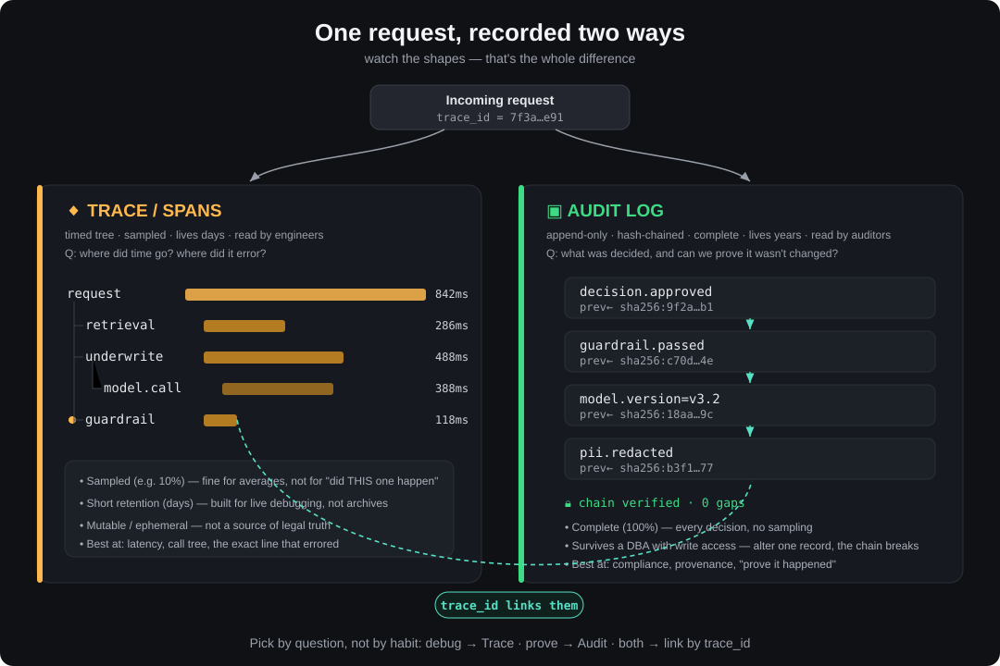
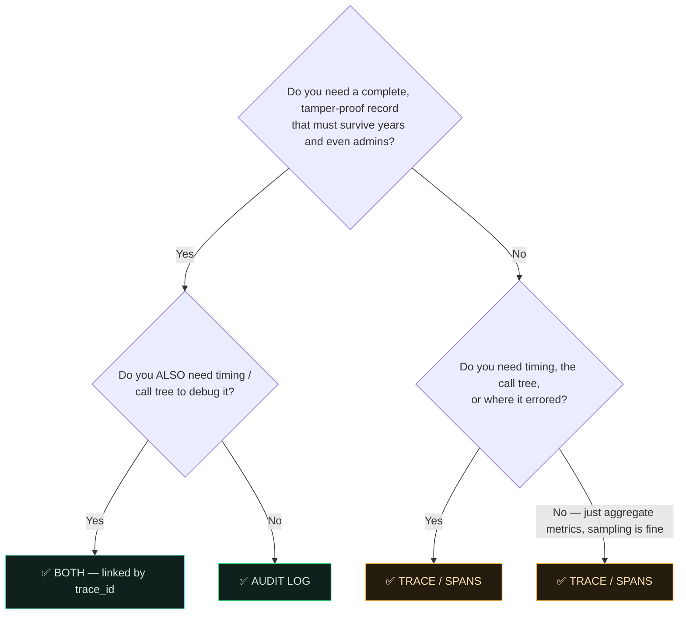
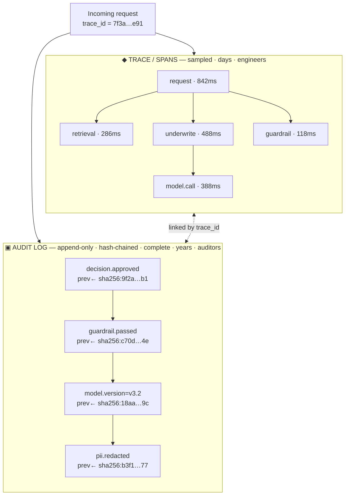

# Trace / Spans vs Audit Log — Choosing the Right Record

> **EY GDS · AI & Data with Claude Code** — observability decision exercise
> For every incident ticket, decide: **Trace / Spans**, **Audit Log**, or **Both — linked by `trace_id`**.

This README explains the underlying concept, gives a one-glance decision rule, and then **justifies the answer to each ticket** captured in the exercise. The architecture diagram below is the heart of it: the *same request* is recorded two completely different ways, and the shape of each recording tells you what it's good for.

---

## 1. The core idea: the same request, recorded two ways

A single request flows through your system once, but two independent subsystems write it down — each optimised for a different reader and a different question.

| | **Trace / Spans** ◆ | **Audit Log** ▣ |
|---|---|---|
| **Unit of record** | One request → a *timed tree of spans* | One decision → an *append-only record* |
| **Shape** | A tree (parent/child spans with durations) | A chain (each record hash-links the previous) |
| **Completeness** | **Sampled** (e.g. keep 10%) | **Complete** (100%, every decision) |
| **Retention** | **Days** | **Years** |
| **Integrity** | Mutable / ephemeral | **Append-only, hash-chained, tamper-evident** |
| **Primary reader** | Engineers | Auditors / Compliance |
| **Answers the question** | *Where did time go? Where did it error?* | *What was decided, and can we prove it wasn't changed?* |
| **Best at** | Latency, the full call tree, the exact failing hop | Provenance, legal proof, "it definitely happened" |

They are not competitors — they are **linked by `trace_id`**. The audit log proves *that* a decision was made; the trace shows *how* the request behaved around it. The same `trace_id` lets you jump from one to the other.

### Why the shapes matter
- A **trace** is a *tree of timed spans* (`request → retrieval → underwrite → model.call`, plus `guardrail`), each with a duration. That structure is exactly what you need to reconstruct a single failing call and see which span blew up.
- An **audit log** is a *hash chain*: each entry stores `prev ← sha256:…` of the entry before it (`decision.approved → guardrail.passed → model.version=v3.2 → pii.redacted`). Change any record and every downstream hash stops matching — so the UI can show **`chain verified · 0 gaps`**. That is what makes it survive tampering.

---

## 2. The decision rule (use this on any ticket)

**Shortcuts:**
- *Debug behaviour / latency / "where did it break?"* → **Trace**
- *Prove it happened, keep it forever, make it tamper-proof* → **Audit Log**
- *Both audiences need it (debug **and** compliance)* → **Both, linked by `trace_id`**
- *"Sampling is fine"* is a strong tell for **Trace**; *"permanent record / survive tampering"* is a strong tell for **Audit Log**.

---

## 3. Architecture (linkage view)

---

## 4. Ticket-by-ticket answers (with justification)

> These are the tickets captured in the screenshots: **04, 05, 06, 08**. The other three (01–03, 07) weren't in the images, so they're left for you to fill in using the rule above.

### 🎫 Ticket 04 / 08 — `SRE on-call`
> *"You're reproducing a single failing request in staging — show the **full call tree** and pinpoint where it errored."*

**Answer → Trace / Spans** ◆

**Why:**
- The phrase *"full call tree"* maps directly onto a span tree (`request → retrieval → underwrite → model.call`, `guardrail`). Only the trace carries parent/child structure **and per-span timing**, so you can see which span errored or hung.
- The audit log is a flat chain of decisions — it can tell you *that* a guardrail passed, but not the nested call path or where latency/error occurred.
- It's a **single request in staging**, so sampling and short retention don't hurt you — you're looking at it live, right now.

---

### 🎫 Ticket 05 / 08 — `FinOps`
> *"FinOps wants **average cost & tokens per request** on a live dashboard. **Sampling 10% is fine** with them."*

**Answer → Trace / Spans** ◆

**Why:**
- You need **aggregates** (averages across many requests), and per-span attributes like `cost` and `tokens` live naturally on spans — perfect for a live metrics dashboard.
- *"Sampling 10% is fine"* is an explicit green light for traces, whose defining trade-off is that they're **sampled**. An average over a representative 10% sample is statistically sound and far cheaper to store.
- An audit log here would be overkill: you don't need 100% completeness, hash-chaining, or multi-year retention to compute an average. You'd be paying for tamper-proof storage to answer a "roughly how much?" question.

---

### 🎫 Ticket 06 / 08 — `Security`
> *"This **decision record must survive even a DBA with write access** trying to alter it three years from now."* — *(Audit Log selected in the exercise)*

**Answer → Audit Log** ▣

**Why:**
- *"Survive even a DBA with write access"* is the textbook case for an **append-only, hash-chained** log. Each record stores `prev ← sha256:…`; if a privileged user edits one record, every downstream hash stops matching and the tamper shows up as a broken chain (`chain verified · 0 gaps` would fail). Write access alone can't silently rewrite history.
- *"Three years from now"* needs **multi-year retention** — traces only live days and are sampled, so the record may not even exist.
- A trace gives you neither tamper-evidence nor longevity, so it can't be the source of legal/compliance truth.

---

### 🎫 Ticket 08 / 08 — `Compliance + SRE`
> *"A guardrail blocked a suspicious transaction. **Compliance needs a permanent record** that it was blocked; **on-call needs to debug why it fired** on a legit-looking request."*

**Answer → Both — linked by `trace_id`** (◆ + ▣)

**Why:**
- Two readers, two questions, in one ticket:
  - **Compliance** → *"permanent record that it was blocked"* → that's the **audit log** (complete, immutable, kept for years): `guardrail.blocked` as a chained record.
  - **On-call / SRE** → *"debug why it fired on a legit-looking request"* → that's the **trace** (the call tree and inputs around the guardrail span, with timing and attributes).
- The **`trace_id`** is what ties them together: the audit entry and the trace share it, so an engineer can pivot from "the compliance record says it was blocked" straight to "here's the exact request and span where the guardrail tripped."
- Picking only one fails a stakeholder: audit-only leaves SRE blind to *why*; trace-only gives compliance nothing durable to point to.

---

## 5. Cheat sheet

| Trigger phrase in the ticket | Pick |
|---|---|
| "full call tree", "where it errored", "reproduce a request", "latency" | **Trace / Spans** |
| "sampling is fine", "average / per-request metrics", "live dashboard" | **Trace / Spans** |
| "permanent record", "survive tampering / a DBA", "keep for years", "prove it" | **Audit Log** |
| "compliance **and** debug", "permanent record **and** why it fired" | **Both — linked by `trace_id`** |

**One sentence to remember:** *Traces are for engineers asking "what happened and how fast?"; audit logs are for auditors asking "what was decided and can we prove it?" — and `trace_id` is the bridge between them.*

---

### Files in this deliverable
- `README.md` — this document
- `architecture.svg` — the hero diagram (referenced at the top)
