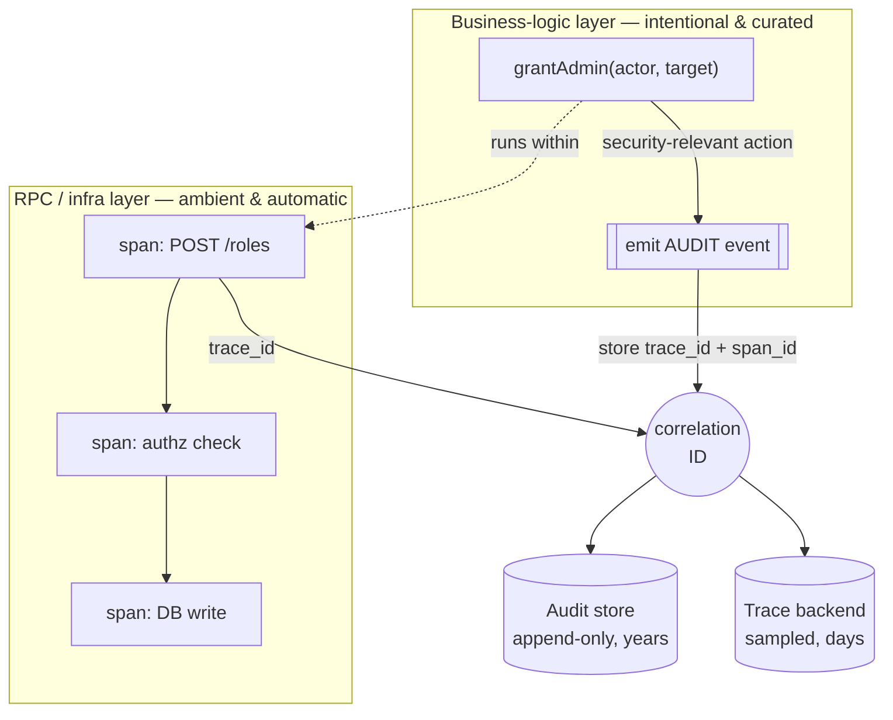
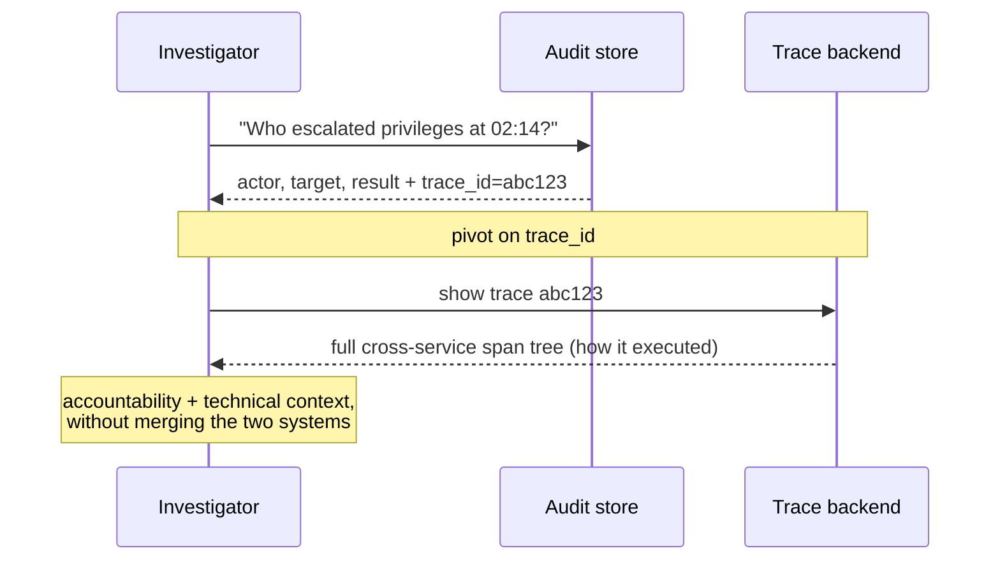
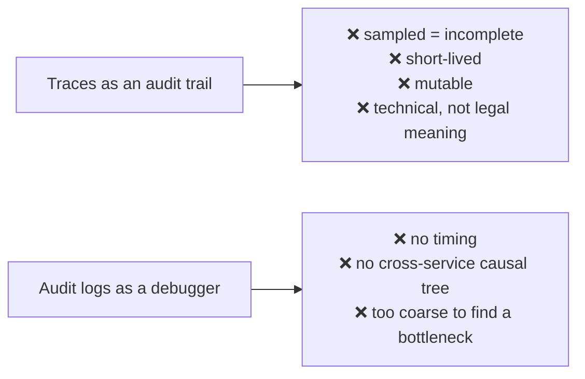
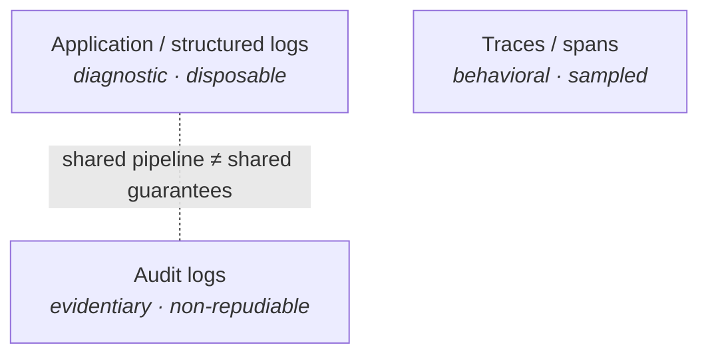
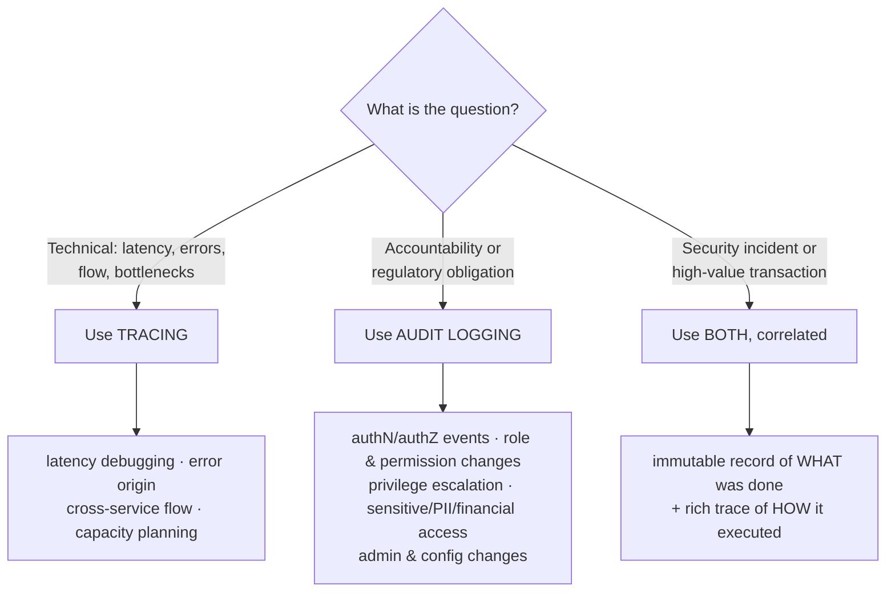

# Traces (Spans) vs. Audit Logging

Both record "what happened," but they answer **different questions for different people**, and conflating them is a common and costly mistake. This note covers how they relate, how to connect them, and when to reach for each.

---

## 1. What each is actually for

| | **Traces / Spans** | **Audit Logs** |
|---|---|---|
| **Question answered** | *How did the system behave?* | *Who did what, to what, when, from where — and was it allowed?* |
| **Primary consumer** | Engineers, SREs | Security, compliance, auditors, IR |
| **Semantics** | Technical (`POST /roles took 43ms`) | Business-level (`user X granted admin to user Y`) |
| **Layer emitted** | Ambient / automatic (RPC + infra) | Intentional / curated (business logic) |
| **Completeness** | Lossy — heavily **sampled** | **Every** event — no sampling |
| **Retention** | Days → weeks | Months → **years** (SOX, HIPAA, PCI-DSS, GDPR) |
| **Mutability** | Mutable, best-effort export | **Append-only, tamper-evident** |
| **Write path** | Fire-and-forget OK | Often **synchronous / transactional** |
| **Cost of dropping a record** | Inconvenient | **Compliance failure / liability** |

> **Rule of thumb:** if losing the record is merely *inconvenient*, it's a **trace**. If losing the record is a *liability*, it's an **audit log**.

---

## 2. How they relate

The two are produced at **different layers** for **different guarantees**. Tracing is instrumented low (at the RPC/infra boundary); audit events are emitted high (in business logic, exactly when a security-relevant action occurs).

The clean way to connect them is a **correlation ID**: stamp the `trace_id` (and `span_id`) into every audit record.

You get **accountability** (audit) *and* **technical context** (trace) — and you can pivot freely between them.

---

## 3. What NOT to do

Don't make one system do the other's job.

**Also distinct from ordinary application logs.** App logs and audit logs often share a pipeline, but app logs are *diagnostic and disposable* while audit logs are *evidentiary*. Treating audit events as "just another log line" is how you end up with sampled, mutable, 7-day-retained records that don't survive a real audit.

---

## 4. When to use which

**Use tracing** when the question is technical — latency debugging, finding where an error originates, understanding flow across microservices, spotting bottlenecks, capacity planning.

**Use audit logging** when the question is about accountability or you have a regulatory obligation — authentication/authorization events, permission and role changes, privilege escalation, access to sensitive/PII/financial data, admin and config changes. Anything that must be non-repudiable and defensible later.

**Use both, correlated**, for security incident response and high-value transactions — the immutable record of *what was done* alongside the rich trace of *how it executed*.

---

## 5. One-line summary

> Tracing tells you **how the machine behaved** and is allowed to forget. Audit logging tells you **who is accountable** and is not allowed to forget. Link them by `trace_id`; never substitute one for the other.
