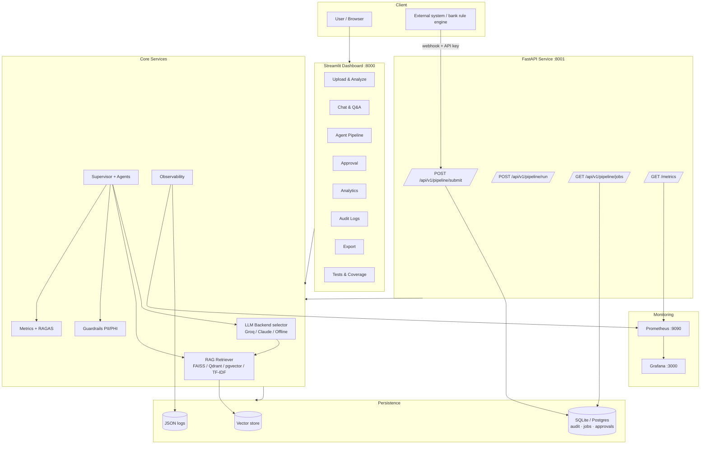
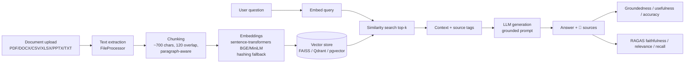
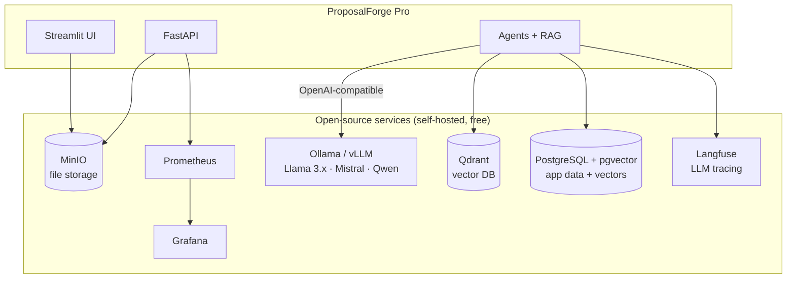
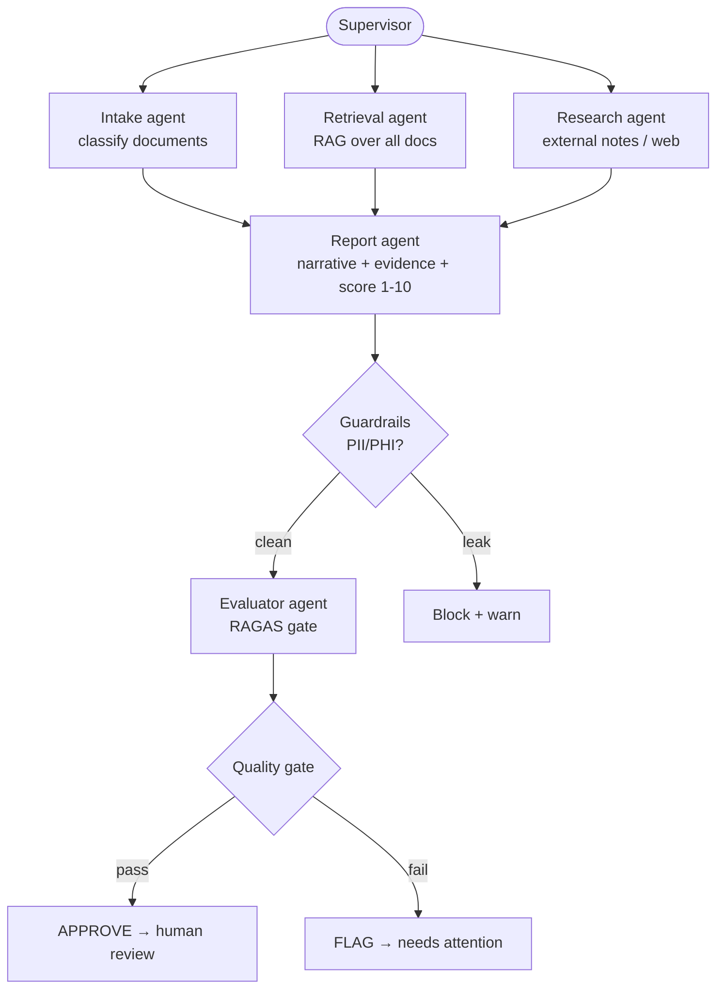
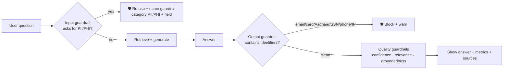
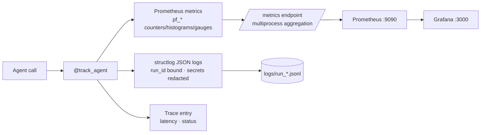
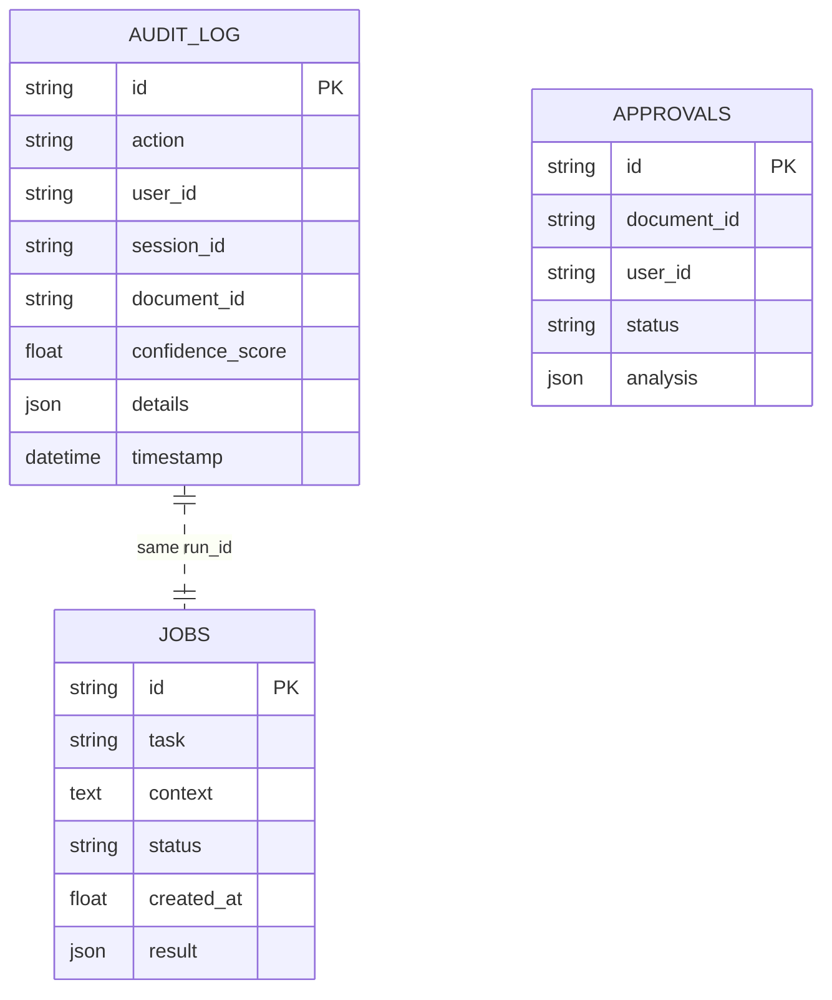
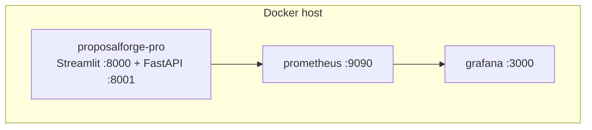
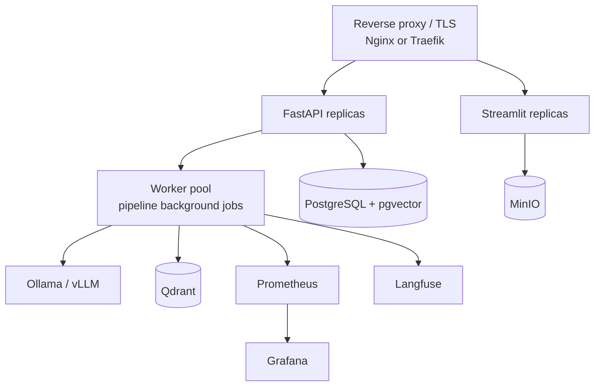

# ProposalForge Pro — Detailed Design Document

**Version:** 1.0  ·  **Status:** Implemented (showcase) + production roadmap
**Scope:** A multi-agent, retrieval-augmented document-analysis platform with
observability, guardrails, and a RAGAS quality gate — built to run **fully on
free / open-source components in production** (no Azure OpenAI, no paid managed
services required).

---

## 1. Overview

ProposalForge Pro ingests one or more documents (PDF, DOCX, CSV, XLSX, PPTX, TXT,
MD), indexes them for retrieval, and answers questions grounded in their content.
A **supervisor-orchestrated multi-agent pipeline** turns a document set + a task
into a structured, evidence-backed report with a quality score, gated by a
RAGAS-style evaluator. Every answer is scored (groundedness / usefulness /
accuracy), checked by **PII/PHI guardrails**, and logged for audit and analytics.

The platform runs in three modes, selected automatically:

| Mode | Trigger | Behaviour |
|------|---------|-----------|
| **Live LLM** | `GROQ_API_KEY` or `CLAUDE_API_KEY` set | Real LLM reasoning |
| **DEMO / offline** | no keys | Deterministic extractive answers + TF‑IDF retrieval |
| **Hybrid** | partial deps | e.g. FAISS local vectors + offline generation |

**Design principle — graceful degradation:** every external dependency has a
built-in fallback, so the system always runs end-to-end even with zero keys and
zero managed services. This is also what makes a 100% open-source production
deployment straightforward.

### Goals
- Grounded, source-attributed answers over multiple documents.
- Transparent quality measurement (per-answer metrics + RAGAS gate).
- Strong data protection (input + output PII/PHI guardrails).
- Production observability (metrics, logs, traces, dashboards).
- **Run on free/open-source infrastructure** — swappable, no vendor lock-in.

### Non-goals
- Training/fine-tuning models (uses off-the-shelf open models).
- A general chatbot — answers are scoped to uploaded documents unless the user
  opts into general knowledge.

---

## 2. High-Level Architecture



Two processes share state through the database and a shared Prometheus
multiprocess directory: the **Streamlit dashboard** (interactive) and the
**FastAPI service** (webhook + metrics). This separation is what lets an external
system POST a job that the dashboard then picks up.

---

## 3. RAG Subsystem (Retrieval-Augmented Generation)

RAG is the heart of the system: it keeps answers grounded in the uploaded
documents and supplies the evidence used for scoring and the RAGAS gate.



**Pipeline stages**

1. **Extraction** — per-format text extraction; long documents are represented by
   a *representative excerpt* sampled across the whole file (not just the head).
2. **Chunking** — paragraph-aware splitter (~700 chars, 120 overlap), tagging each
   chunk with its **source filename** so answers can be attributed across many docs.
3. **Embeddings** — pluggable: `sentence-transformers` (e.g. BGE/MiniLM) when
   available, deterministic hashing vectorizer otherwise.
4. **Indexing** — pluggable backend, auto-selected via `VECTOR_BACKEND`.
5. **Retrieval** — top-k cosine similarity; returns `{text, score, source}`.
6. **Generation** — retrieved chunks are assembled into a grounded prompt with
   source markers; the LLM (or offline extractor) answers.
7. **Scoring & gating** — groundedness vs. the retrieved context, usefulness, and
   a composite accuracy; RAGAS faithfulness/relevance/recall feed the quality gate.

**Multi-document Q&A:** all documents are indexed into one combined store with
per-chunk source tags, so a single question is answered across the whole set and
the answer lists exactly which documents it drew from.

---

## 4. Open-Source / Free Production RAG Stack (Azure-OpenAI-free)

The architecture is **vendor-neutral by design**. Each managed component has a
free, open-source, production-grade replacement. Nothing here requires Azure
OpenAI, OpenAI, Pinecone, or any paid SaaS.

### 4.1 Replacement map

| Layer | Managed / paid (avoid) | **Open-source & free (use)** | Notes |
|-------|------------------------|------------------------------|-------|
| **LLM generation** | Azure OpenAI, OpenAI GPT-4 | **Ollama** (Llama 3.1/3.3, Mistral, Qwen2.5, Phi-3) for local; **vLLM** or **HF TGI** for high-throughput serving; **Groq** free tier for hosted-but-free | OpenAI-compatible APIs → drop-in |
| **Embeddings** | Azure / OpenAI `text-embedding-3` | **BGE** (`bge-base-en-v1.5`, `bge-m3`), **E5**, **GTE**, **Nomic-embed** via `sentence-transformers` | Run on CPU; GPU optional |
| **Vector store** | Azure AI Search, Pinecone | **Qdrant**, **pgvector** (Postgres), **Weaviate**, **Milvus**, **Chroma**, **FAISS** (in-process) | Qdrant or pgvector recommended for prod |
| **Reranking** (optional) | Cohere Rerank | **bge-reranker-v2-m3**, cross-encoder (`ms-marco-MiniLM`) | Boosts precision |
| **Orchestration** | Azure AI Studio flows | **LangGraph/LangChain** or the built-in supervisor | Already implemented as custom supervisor |
| **Evaluation** | proprietary eval | **RAGAS** (+ built-in heuristics) | Faithfulness/relevance/recall |
| **Tracing** | Azure Monitor, LangSmith | **Langfuse** (self-host), **OpenTelemetry + Jaeger** | Free, self-hostable |
| **Metrics/dashboards** | App Insights | **Prometheus + Grafana** | Already wired |
| **Relational store** | Azure SQL | **PostgreSQL** (+ pgvector) | One engine for data *and* vectors |
| **Object storage** | Azure Blob | **MinIO** (S3-compatible) | For uploaded files at scale |

### 4.2 Recommended production stack



**Why this stack:**
- **Ollama / vLLM** expose an **OpenAI-compatible** endpoint, so the existing
  `llm_backend` selector points at them by changing a base URL — no rewrite.
  Ollama is ideal for a single box / demo; vLLM or TGI for throughput and batching.
- **Qdrant** (Docker, Apache-2.0) is a fast, production vector DB with filtering
  and persistence; **pgvector** is the lowest-ops option if you already run
  Postgres (one database for both relational data and vectors).
- **BGE/E5 embeddings** rival paid embeddings on quality and run on CPU.
- **Langfuse** replaces LangSmith for trace trees; **Prometheus + Grafana** stay
  for metrics. All self-hostable and free.

### 4.3 Migration path from the current code

The current retriever already supports `pinecone | faiss | tfidf`. Adding Qdrant
or pgvector is a new backend class implementing the same interface
(`build_documents`, `search → [{text, score, source}]`), selected by
`VECTOR_BACKEND`. Concretely:

```text
VECTOR_BACKEND=qdrant            # new backend
QDRANT_URL=http://qdrant:6333
EMBEDDING_MODEL=BAAI/bge-base-en-v1.5

# LLM via Ollama (OpenAI-compatible) — reuse the Groq/OpenAI client path
LLM_BASE_URL=http://ollama:11434/v1
LLM_MODEL=llama3.1:8b
```

Because the LLM client is OpenAI-compatible and the retriever is interface-based,
**no business logic changes** — only configuration and two small adapter classes.

### 4.4 Example: add Qdrant + Ollama to `docker-compose`

```yaml
  ollama:
    image: ollama/ollama:latest
    ports: ["11434:11434"]
    volumes: ["ollama:/root/.ollama"]

  qdrant:
    image: qdrant/qdrant:latest
    ports: ["6333:6333"]
    volumes: ["qdrant:/qdrant/storage"]
```

---

## 5. Multi-Agent Pipeline

A **Supervisor** orchestrates five specialist agents hub-and-spoke. Each agent is
wrapped by a `@track_agent` decorator that records latency, status, logs, and
metrics, and contributes a trace entry.



| Agent | Responsibility |
|-------|----------------|
| **Intake** | Parse & classify the uploaded document set |
| **Retrieval** | RAG over all docs; returns chunks + sources |
| **Research** | External research notes (offline stub; pluggable to Tavily/SearXNG) |
| **Report** | Narrative, objective, challenges, solutions, evidence table, actions, 1–10 score |
| **Evaluator** | RAGAS faithfulness / relevance / recall → APPROVE / FLAG |

The pipeline returns one structured object (per-agent traces, the report, RAGAS
scores, gate verdict, guardrail audit, timing) rendered in the **Agent Pipeline**
tab with an SVG score gauge and timeline, and downloadable as JSON.

---

## 6. Guardrails (Data Protection)

Two-sided PII/PHI protection plus answer-quality guardrails.



- **Input guardrail** detects requests for PII (SSN, Aadhaar, card/CVV, bank,
  passport, phone, email, address, DOB, password, license) and PHI (medical
  record, diagnosis, prescription, labs, mental health, treatment history),
  including soft phrasings ("contact details", "account information"). It names
  the guardrail type, category (PII/PHI), and field, then refuses.
- **Output guardrail** scans the generated answer for structured identifiers and
  blocks them even if the question slipped through.
- **Suggestion filtering** ensures autosuggestions never propose sensitive queries.
- Every trigger is recorded to the audit log.

---

## 7. Observability

One decorator, three pillars.



- **9 Prometheus metrics** (`pf_agent_calls_total`, `pf_agent_latency_seconds`,
  `pf_llm_tokens_total`, `pf_guardrail_hits_total`, `pf_pipeline_latency_seconds`,
  `pf_last_quality_score`, `pf_active_runs`, `pf_supervisor_iterations_total`,
  `pf_ragas_faithfulness`).
- **Multiprocess mode** aggregates metrics from both the Streamlit and FastAPI
  processes so a run from either shows on the scraped endpoint.
- **5 alert rules** (latency, guardrail spike, agent errors, active runs, low RAGAS).
- **Grafana** dashboard auto-provisioned. Optional **Langfuse** for trace trees.

---

## 8. Data Model & Persistence



- **Dev/demo:** SQLite in WAL mode (concurrent reads, cross-process safe).
- **Production:** PostgreSQL via `DATABASE_URL`; the same schema applies. With
  **pgvector**, the vector index can live in the same Postgres instance.

---

## 9. API Surface

| Method | Path | Purpose |
|--------|------|---------|
| `GET` | `/health` | Liveness |
| `GET` | `/metrics` | Prometheus exposition (multiprocess-aggregated) |
| `POST` | `/api/v1/pipeline/run` | Run pipeline synchronously |
| `POST` | `/api/v1/pipeline/submit` | **Webhook** — accept job, run in background |
| `GET` | `/api/v1/pipeline/jobs` | List recent jobs |
| `GET` | `/api/v1/pipeline/jobs/{id}` | Fetch a job + result |
| `POST` | `/api/v1/documents/upload` | Upload & analyze |
| `GET` | `/api/v1/analytics/*` | Accuracy / evaluation / suggestions |

**Webhook flow:** submit → `202 accepted` + `job_id` → background pipeline →
result persisted → dashboard polls the shared job store and renders it.

---

## 10. Deployment

### 10.1 Single-host (current, Docker Compose)



### 10.2 Scaled production topology (all open-source)



- Stateless UI/API replicas behind Nginx/Traefik (free).
- A worker pool runs pipelines (move background tasks to Celery/RQ + Redis for
  scale, or keep FastAPI BackgroundTasks for light loads).
- Postgres for data (+ pgvector) or Qdrant for vectors; MinIO for files.
- Everything in this topology is free and self-hostable.

---

## 11. Security & Compliance

- **Data protection:** input + output PII/PHI guardrails; PII redaction on
  display; audit trail of every guardrail trigger.
- **Secrets:** API keys only from environment/`.env`, never from the UI; secrets
  redacted in logs.
- **Webhook auth:** API-key header (extend to OAuth/JWT for production).
- **Least data:** answers are scoped to uploaded documents by default.
- **Self-hosting** the full open-source stack keeps sensitive documents on
  infrastructure you control — a key advantage over Azure OpenAI for regulated data.

---

## 12. Scalability & Performance

- **Retrieval:** swap in-process FAISS for Qdrant/pgvector for large corpora and
  concurrent users; add a reranker for precision.
- **LLM throughput:** vLLM/TGI batch requests; Ollama for single-node.
- **Background jobs:** Celery/RQ + Redis for many concurrent pipelines.
- **DB:** Postgres with connection pooling; WAL/replicas as needed.
- **Caching:** cache embeddings and frequent retrievals.

---

## 13. Testing Strategy

- **Unit/integration:** `pytest` suite (~40 tests) over metrics, retriever, audit,
  LLM client, guardrails, job store, observability, pipeline, approvals.
- **Coverage:** measured with `coverage`, scoped to product modules (~52%),
  surfaced in the **Tests & Coverage** tab.
- **Determinism:** LLM tests use `monkeypatch` to remove ambient keys so results
  are stable regardless of environment.
- **Hermetic guardrail tests** assert both PII and PHI categorization.

---

## 14. Configuration

| Variable | Purpose | Example |
|----------|---------|---------|
| `GROQ_API_KEY` / `CLAUDE_API_KEY` | Live LLM (optional) | — |
| `LLM_BASE_URL` / `LLM_MODEL` | Open-source LLM (Ollama/vLLM) | `http://ollama:11434/v1`, `llama3.1:8b` |
| `VECTOR_BACKEND` | Retriever | `qdrant` / `faiss` / `pgvector` / `tfidf` |
| `EMBEDDING_MODEL` | Embeddings | `BAAI/bge-base-en-v1.5` |
| `QDRANT_URL` | Qdrant endpoint | `http://qdrant:6333` |
| `DATABASE_URL` | Postgres | `postgresql://…` |
| `PROMETHEUS_MULTIPROC_DIR` | Shared metrics | `/tmp/pf_metrics` |
| `ENABLE_PII_REDACTION` | Redaction | `True` |

---

## 15. Roadmap / Future Work

1. **Qdrant + pgvector backends** (interface already supports it).
2. **Ollama/vLLM** as the default open-source LLM in compose.
3. **Real web research** for the Research agent (SearXNG self-host = free, or Tavily).
4. **Reranking** with `bge-reranker` for higher precision.
5. **Auth** (OAuth/JWT) and **Postgres** as defaults for production.
6. **Langfuse** tracing alongside Prometheus/Grafana.
7. **Celery/RQ + Redis** worker pool for concurrent pipelines.

---

## Appendix A — Component summary

| Concern | Implemented now | Open-source production target |
|---------|-----------------|-------------------------------|
| LLM | Groq / Claude / **Ollama·vLLM (LLM_BASE_URL)** / offline | Ollama / vLLM / Groq |
| Embeddings | sentence-transformers (**EMBEDDING_MODEL**, e.g. BGE) / hashing | BGE / E5 / GTE |
| Vector DB | FAISS / Pinecone / TF-IDF / **Qdrant / pgvector** | Qdrant / pgvector |
| Orchestration | custom supervisor | custom or LangGraph |
| Eval | RAGAS heuristics | RAGAS |
| Metrics | Prometheus + Grafana | Prometheus + Grafana |
| Tracing | structlog | + Langfuse / OTel |
| Data | SQLite (WAL) | PostgreSQL (+ pgvector) |
| Files | local temp | MinIO |
| Proxy | — | Nginx / Traefik |

*All production targets are free and open-source; none require Azure OpenAI or any
paid managed service.*
